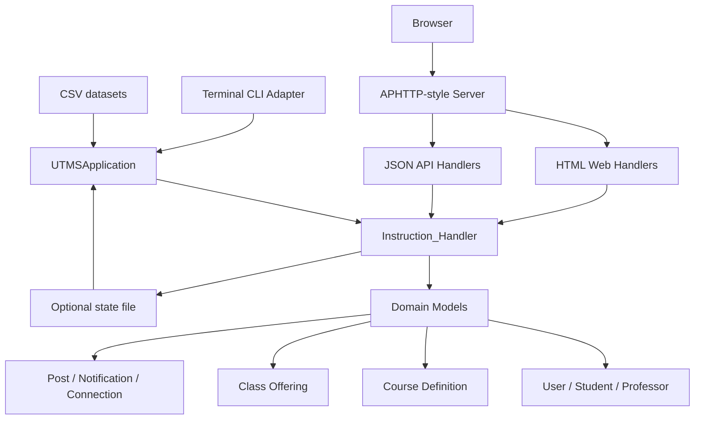
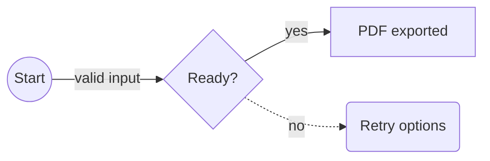
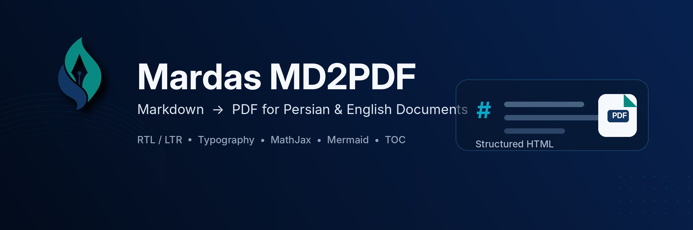

# Introduction

Mardas MD2PDF is a Markdown-to-PDF publishing tool designed for documents that mix Persian and English content. It keeps the writing workflow simple while giving the final PDF a professional printed layout.

The project is useful for reports, university documents, technical guides, educational notes, research drafts, project documentation, and any Markdown file that needs a clean PDF output.

```text
Markdown -> Structured HTML -> Chromium PDF
```

The renderer does not draw paragraphs manually on a PDF canvas. Instead, it converts Markdown into a structured HTML document, applies print-oriented CSS, renders formulas with MathJax, and asks Chromium to produce the final PDF. This gives the project better support for CSS print layout, mixed text direction, SVG formulas, syntax-highlighted code, local images, and complex tables.

> [!NOTE]
> This guide is both documentation and a rendering sample. The PDF version of this file is available in the `examples/` directory, so users can inspect the actual output of every major feature.

## Rendering sample checklist

The guide intentionally contains compact test cases for the renderer. When you review the generated PDF, check that these samples appear correctly:

| Sample area | What to verify in the PDF |
| :--- | :--- |
| Cover and metadata | Title, subtitle, authors, summary, version, status, keywords, and language-specific labels. |
| TOC | Nested heading numbers and links generated from Markdown headings. |
| Mixed direction text | Persian/English text, inline code, and identifiers remain readable in the same paragraph. |
| MathJax | Inline math aligns with text and display equations are centered and scaled. |
| Code blocks | Fenced, indented, and language-less code blocks render without corrupting content. |
| Mermaid | A `flowchart` code fence becomes an SVG diagram instead of a plain code block. |
| Images and HTML | Local Markdown images and safe HTML image tags appear in the PDF. |
| Footnotes and page flow | Multiline footnotes, manual page breaks, margins, and footer numbering remain stable. |

## Main capabilities

Mardas MD2PDF focuses on the features that matter most for polished technical PDFs:

| Capability | Description |
| :--- | :--- |
| Persian and English documents | `lang: fa`, `lang: en`, RTL/LTR shell direction, and mixed inline text. |
| Cover pages | Title, subtitle, authors, summary, logo, date, version, status, keywords, and academic metadata. |
| Table of contents | Hierarchical TOC generated from Markdown headings. |
| MathJax | Inline and display formulas with browser-rendered output. |
| Code blocks | Pygments syntax highlighting for fenced and indented code blocks. |
| Mermaid flowcharts | Offline SVG rendering for practical `flowchart` / `graph` diagrams. |
| Local images | Markdown and safe HTML images can be embedded as data URIs. |
| Safe HTML | Raw HTML is sanitized by default. |
| Footnotes | Multiline Markdown footnotes are supported. |
| Themes and profiles | GitHub, modern, textbook-light, textbook-dark, and academic layouts. |
| Automation | CLI workflow suitable for local scripts and CI jobs. |
| GUI | Local browser-based editor, preview, option selector, and exporter. |

# Installation

## Requirements

Before using the project, make sure you have:

- Python 3.10 or newer;
- a working virtual environment;
- Playwright Chromium installed;
- a Persian-capable font on the system, preferably Vazirmatn;
- Git, if you plan to clone the repository.

## Install from source

```bash
git clone https://github.com/mragetsars/Mardas-MD2PDF.git
cd Mardas-MD2PDF
python -m venv .venv
source .venv/bin/activate
pip install -e .
python -m playwright install chromium
```

On Windows PowerShell:

```powershell
python -m venv .venv
.venv\Scripts\Activate.ps1
pip install -e .
python -m playwright install chromium
```

## Development installation

For development, install the optional test dependencies:

```bash
pip install -e .[dev]
pytest
```

The package exposes two console commands:

| Command | Purpose |
| :--- | :--- |
| `mrs-md2pdf` | Convert Markdown files to PDF from the command line. |
| `mrs-md2pdf-gui` | Launch the local browser-based graphical interface. |

# First PDF

Create a simple PDF:

```bash
mrs-md2pdf input.md -o output.pdf
```

Create a PDF with a table of contents and the modern theme:

```bash
mrs-md2pdf input.md -o output.pdf --toc --profile github
```

Create a long report with book-like page flow:

```bash
mrs-md2pdf input.md -o output.pdf \
  --toc \
  --toc-depth 4 \
  --toc-page-break \
  --h1-page-break \
  --profile minimal
```

Save the intermediate HTML for debugging:

```bash
mrs-md2pdf input.md -o output.pdf --debug-html output.html
```

Show the progress bar explicitly in terminal sessions:

```bash
mrs-md2pdf input.md -o output.pdf --progress on
```

By default, `--progress auto` shows the progress bar only when the command is running in an interactive terminal. Use `--progress off` for quiet scripts.

# Recommended Workflow

A clean PDF workflow usually looks like this:

1. Write the content in Markdown.
2. Add YAML front matter for title, authors, language, direction, and cover metadata.
3. Render a first PDF with `--toc` and the desired theme.
4. Review the cover, table of contents, math pages, code pages, image pages, and footer numbering.
5. If layout debugging is needed, export `--debug-html` and inspect the generated HTML in a browser.
6. Finalize the Markdown and render again.

For important documents, always review the final PDF visually. Automated tests can catch many problems, but typography, spacing, and page breaks still need human review.

# Front Matter

Front matter is optional YAML placed at the beginning of the Markdown file. It controls the cover page, PDF metadata, document language, document direction, and several report-specific fields.

```yaml
---
title: "My Technical Report"
subtitle: "A Markdown-powered PDF document"
authors:
  - name: "Mardas"
    email: "mragetsars@gmail.com"
    affiliation: "Mardas Lab"
    role: "Author"
summary: |
  This text appears on the cover.
  Multiline summaries are supported.
institution: "University or Organization"
department: "Department name"
course: "Course or project title"
supervisor: "Supervisor name"
date: "2026-05-20"
version: "1.5.2"
status: "Draft"
keywords: [Markdown, PDF, RTL, MathJax]
cover_label: "Technical Report"
cover_logo: "src/assets/Mardas.png"
lang: en
dir: ltr
---
```

## Common fields

| Field | Purpose |
| :--- | :--- |
| `title` | Cover title and PDF metadata title. |
| `subtitle` | Optional text under the main title. |
| `author` | Simple single-author value. |
| `authors` | List of author objects with optional `name`, `email`, `affiliation`, and `role`. |
| `summary` / `description` | Cover summary and PDF metadata subject. |
| `institution`, `department`, `course` | Academic or organizational context. |
| `supervisor`, `group`, `student_id` | Optional report metadata fields. |
| `date`, `version`, `status` | Cover cards used for document state. |
| `keywords` / `tags` | Cover keywords and PDF metadata keywords. |
| `cover_label` | Small label above the cover title. |
| `cover_logo` / `logo` | Custom logo path relative to the Markdown file. |
| `lang` | Built-in UI language, usually `en` or `fa`. |
| `dir` | Document shell direction: `auto`, `ltr`, or `rtl`. |

## Cover behavior

The cover is rendered separately from the main document. This gives the output cleaner page numbering and better watermark behavior:

- the cover is not counted as a content page;
- footer page numbering starts after the cover;
- watermarks are applied to content pages only;
- the cover may use full-page theme backgrounds;
- the cover can be disabled when a plain document is needed.

Disable the cover:

```bash
mrs-md2pdf input.md -o output.pdf --no-cover
```

Use a custom logo:

```bash
mrs-md2pdf input.md -o output.pdf --cover-logo ./src/assets/Mardas.png
```

Keep the cover but hide the logo:

```bash
mrs-md2pdf input.md -o output.pdf --no-cover-logo
```

# Language and Direction

Direction is one of the most important parts of Persian/English PDF generation. Mardas MD2PDF separates language selection from direction control.

`lang: en` creates an English/LTR document shell, English cover labels, English callout titles, and a `Table of Contents` heading.

`lang: fa` creates a Persian/RTL document shell, Persian cover labels, Persian callout titles, and a `فهرست مطالب` heading.

## Direction priority

The document direction is resolved in this order:

1. CLI `--dir rtl|ltr|auto`
2. front matter fields such as `dir`, `direction`, `text_direction`, or `document_direction`
3. language-derived default from `lang`
4. automatic detection from the Markdown body

## Mixed text examples

English writing can include Persian terms such as راست به چپ, فونت فارسی, and گزارش فنی without breaking the surrounding sentence.

Persian writing can include English identifiers such as `Playwright`, `MathJax`, `GitHub Actions`, `PDF`, and `RTL/LTR` inside the same paragraph.

Inline code remains stable: `mrs-md2pdf input.md -o output.pdf --toc`.

# Table of Contents

Enable the table of contents:

```bash
mrs-md2pdf input.md -o output.pdf --toc
```

Control the depth:

```bash
mrs-md2pdf input.md -o output.pdf --toc --toc-depth 3
```

Start the body on a new page after the TOC:

```bash
mrs-md2pdf input.md -o output.pdf --toc --toc-page-break
```

Start each top-level heading on a new page:

```bash
mrs-md2pdf input.md -o output.pdf --h1-page-break
```

The TOC is generated from Markdown headings and preserves readable inline math in headings such as $E = mc^2$ and $\epsilon$.

# Markdown Feature Reference

## Paragraphs and emphasis

Markdown paragraphs, **bold text**, *italic text*, `inline code`, links, ordered lists, unordered lists, task lists, and blockquotes are supported.

## Lists

- Write content in Markdown.
- Add front matter for metadata.
- Render with the desired theme.
- Review the final PDF.

1. Install the package.
2. Install Chromium.
3. Run the CLI.
4. Inspect the output.

## Task lists

- [x] Markdown input
- [x] Persian/English typography
- [x] MathJax rendering
- [x] Code highlighting
- [ ] Final human review

## Tables

| Feature | Status | Notes |
| :--- | :---: | :--- |
| Mixed RTL/LTR text | Yes | Paragraphs, headings, lists, and table cells receive direction-aware styling. |
| Local images | Yes | Markdown and safe HTML images are embedded when possible. |
| MathJax | Yes | Inline and display math use separate sizing rules. |
| Code highlighting | Yes | Pygments is used for fenced and indented code blocks. |
| Mermaid diagrams | Yes | Practical `flowchart` and `graph` fences are rendered as inline SVG diagrams. |
| Footnotes | Yes | Multiline Markdown footnotes are supported. |
| Raw HTML sanitizer | Yes | Unsafe tags and event handlers are removed by default. |

## Blockquotes

> Good PDF publishing is more than text conversion. Typography, line height, contrast, page flow, images, formulas, and predictable rendering all matter.

## Callouts

Callouts use GitHub-style markers and are translated according to the document language.

> [!NOTE]
> Use callouts for explanatory notes that should stand out visually.

> [!TIP]
> Use `--debug-html output.html` when you need to inspect the exact HTML sent to Chromium.

> [!WARNING]
> Use `--unsafe-html` only for trusted local Markdown because it disables the built-in sanitizer.

# GitHub-style Markdown Compatibility

Version 1.5.2 tightens the local asset trust boundary, adds Studio payload limits, introduces CI, and documents the release workflow while keeping the GitHub-like Markdown rendering behavior introduced in the 1.5 series.

## Rendering profiles

Use the GitHub profile when the source document is similar to a README, project guide, API note, or engineering document:

```bash
mrs-md2pdf README.md -o README.pdf --profile github --toc
```

The profile selects the `github` visual theme unless you explicitly pass `--theme`. You can still override the theme manually:

```bash
mrs-md2pdf input.md -o output.pdf --profile github --theme modern
```

## Alerts

GitHub-style alerts are written as blockquotes and become highlighted PDF callouts:

> [!NOTE]
> Notes are useful for neutral explanations.

> [!IMPORTANT]
> Important blocks should contain information the reader should not miss.

> [!CAUTION]
> Caution blocks are intended for destructive or risky actions.

## Autolinks

Bare URLs and email addresses are linked automatically outside code spans:

- Project page: www.example.com/mardas-md2pdf
- Maintainer contact: docs@example.com
- Literal code remains unchanged: `www.example.com`

## Details and summary

HTML disclosure blocks are opened and styled for PDF output because a printed document cannot be interactive:

<details>
<summary>Advanced conversion notes</summary>
<p>This content is visible in the PDF and receives a printable disclosure-block style.</p>
</details>

## Heading anchors

Every heading receives a stable ID and a small permalink anchor. This improves internal links in the generated HTML and makes the PDF more navigable when links are preserved by the viewer.

## Manual page breaks

For reports that need controlled pagination, use any of these forms:

```md
<!-- pagebreak -->
```

```md
:::pagebreak
::: 
```

```md
---page---
```

The renderer normalizes them into the same PDF page-break element.

# MathJax

Inline math should match the surrounding line height: $E = mc^2$, $T = 500$, and $\Sigma = I \cdot \epsilon$ should sit naturally inside a paragraph.

Display math receives more visual space:

$$
\int_{-\infty}^{\infty} e^{-x^2}\,dx = \sqrt{\pi}
$$

A matrix example:

$$
A = \begin{bmatrix}
1 & 2 \\
3 & 4
\end{bmatrix}, \qquad \det(A) = -2
$$

An aligned equation block:

$$
\begin{aligned}
\text{precision} &= \frac{TP}{TP + FP} \\
\text{recall} &= \frac{TP}{TP + FN}
\end{aligned}
$$

## Math troubleshooting

If math appears as raw TeX:

- make sure `--no-mathjax` was not used;
- check the terminal for MathJax warnings;
- increase the browser timeout for very large math-heavy documents;
- render a smaller test file to isolate the problematic formula.

# Code Blocks

Fenced code blocks support syntax highlighting and language labels.

```python
from dataclasses import dataclass

@dataclass
class Document:
    title: str
    lang: str = "en"


def render_message(doc: Document) -> str:
    return f"Rendering {doc.title} as PDF"

print(render_message(Document("Mardas Guide")))
```

```javascript
const items = ["Markdown", "Persian", "English", "MathJax", "PDF"];
const message = items.map((item, index) => `${index + 1}. ${item}`).join("\n");
console.log(message);
```

Code fences without a language are also valid:

```
This block has no explicit language.
It should still render safely.
```

Indented code blocks are supported:

    SELECT title, lang, version
    FROM documents
    WHERE renderer = 'mardas-md2pdf';

Inline code is protected from math and footnote processing. For example, `$x$` and `[^note]` remain literal when they are inside backticks.

## Enhanced code fences

Code fences can carry a filename/title, line numbers, and highlighted lines. This is useful when the PDF should act as a teaching or review artifact.

````md
```python title="renderer.py" {2,5-6} linenos
def convert(markdown: str) -> bytes:
    html = render_markdown(markdown)
    pdf = render_pdf(html)
    return pdf
```
````

The example above renders as a code block with a custom caption, line-number table, and highlighted lines:

```python title="renderer.py" {2,5-6} linenos
def convert(markdown: str) -> bytes:
    html = render_markdown(markdown)
    pdf = render_pdf(html)
    return pdf
```

# Mermaid Flowcharts

Mermaid-style flowchart fences are rendered as SVG diagrams during HTML post-processing. The renderer currently focuses on the common project-documentation subset: `flowchart` / `graph`, `TD`, `TB`, `BT`, `LR`, `RL`, rectangle nodes, rounded nodes, circles, diamonds, solid edges, dotted edges, thick edges, and labelled arrows.

The important point for the final PDF is that the following block should appear as a diagram, not as source code:



A smaller labelled-edge sample is useful when checking edge labels and node shapes:



If a Mermaid block uses advanced syntax outside the supported subset, keep a small fallback screenshot or image in the Markdown until that syntax is added to the renderer. For ordinary architecture and data-flow diagrams, the built-in renderer is enough and does not need internet access.

# Images and Safe HTML

Markdown images are embedded when they point to local files. A common caption pattern is also promoted to a real PDF figure:

```md


*Figure 1. Architecture overview.*
```

When the caption starts with `Figure`, `Fig.`, `شکل`, or `تصویر`, the renderer wraps the image and caption in a semantic figure block. Safe HTML image attributes such as `width` and `height` are preserved:

```html

```


Images are resolved relative to the Markdown file. Local images are embedded into the generated HTML/PDF when they are small enough to embed safely.



Safe raw HTML images can also be used when explicit sizing is needed:


## Image rules

- Prefer local images for stable PDF output.
- Keep images reasonably sized before embedding them.
- Use paths relative to the Markdown file.
- Keep image paths inside the Markdown document directory. Absolute paths, `file:` URLs, parent-directory escapes such as `../secret.png`, and current-working-directory fallbacks are blocked by default.
- If a local image cannot be embedded safely, it is replaced with a transparent blocked placeholder so Chromium does not load it through the document `<base>` URL.
- In the GUI, attach local image files or image folders before exporting.
- Very large images are blocked and a warning is printed to avoid excessive memory usage.

## Safe HTML

Raw HTML is sanitized by default. The sanitizer keeps document-oriented elements such as `<div>`, `<span>`, `<table>`, `<figure>`, and ``, while removing active or unsafe content such as scripts, event handlers, iframes, forms, remote stylesheets, `file:` URLs, unsafe URL schemes, and non-raster `data:` image URLs.

Safe `data:` images are limited to common raster formats such as PNG, JPEG, GIF, WebP, BMP, and AVIF. Inline SVG data URLs are blocked in safe HTML; use a local SVG/PNG file you trust or a Mermaid block for diagrams.

Use unsafe HTML only for trusted local files:

```bash
mrs-md2pdf input.md -o output.pdf --unsafe-html
```

<div class="md2pdf-page-break"></div>


# Security and Trusted Inputs

Mardas MD2PDF is a local publishing tool. Treat Markdown, GUI attachments, cover logos, watermarks, and raw HTML as trusted author content unless you run the converter inside an isolated environment.

Default rendering keeps a conservative file boundary: local images are resolved relative to the Markdown file, embedded as `data:` URLs when safe, and blocked when they point outside the document directory or cannot be embedded. Raw HTML is sanitized unless `--unsafe-html` is used.

Chromium sandboxing is controlled by `--chromium-sandbox`:

| Mode | Behavior |
| :--- | :--- |
| `auto` | Keep sandboxing on for normal users; disable only when running as root. |
| `on` | Always request Chromium sandboxing. |
| `off` | Pass `--no-sandbox`; use only in trusted containers or isolated CI jobs. |

For untrusted documents, render in a container or disposable environment and keep `--unsafe-html` off. See `SECURITY.md` for the full policy.

# Page Flow and Layout

## Manual page breaks

A manual page break can be inserted with safe HTML:

```html
<div class="md2pdf-page-break"></div>
```

## Page size

Use a named page size:

```bash
mrs-md2pdf input.md -o output.pdf --page-size A4
```

Use landscape orientation:

```bash
mrs-md2pdf input.md -o output.pdf --page-size "A4 landscape"
```

Use explicit dimensions:

```bash
mrs-md2pdf input.md -o output.pdf --page-size "210mm 297mm"
```

## Margins

```bash
mrs-md2pdf input.md -o output.pdf \
  --margin-top 18mm \
  --margin-bottom 18mm \
  --margin-x 16mm
```

# Watermarks

Text watermark:

```bash
mrs-md2pdf input.md -o output.pdf --watermark "DRAFT"
```

Image watermark:

```bash
mrs-md2pdf input.md -o output.pdf \
  --watermark-image ./src/assets/Mardas.png \
  --watermark-opacity 0.05 \
  --watermark-width 95mm
```

Watermarks are applied to content pages only, not to the cover page.

# Themes

Mardas MD2PDF includes built-in themes and profile presets. Profiles choose sensible defaults for a document type; themes control the visual CSS.

| Theme | Best for |
| :--- | :--- |
| `github` | README-like project documentation and GitHub-style Markdown output. |
| `modern` | General documentation, proposals, software reports, and product-style guides. |
| `textbook-light` | Long educational documents, course notes, Persian/English learning material. |
| `textbook-dark` | Screen reading, low-light review, and presentation-like technical notes. |
| `academic` | Formal reports, university documents, thesis-like drafts, and structured papers. |

Choose a profile or theme with:

```bash
mrs-md2pdf input.md -o output.pdf --profile github
mrs-md2pdf input.md -o output.pdf --theme academic
```

# GUI Workflow

Launch the GUI:

```bash
mrs-md2pdf-gui
```

The GUI is useful for users who prefer a visual workflow:

1. Paste or type Markdown.
2. Select theme, language, direction, page size, and export options.
3. Attach local image files or image folders.
4. Preview the document approximately.
5. Export the final PDF and watch the export progress indicator in the footer.

> [!IMPORTANT]
> The GUI preview is approximate. The final PDF is produced by the backend renderer, which applies the full Markdown processing, theme CSS, MathJax rendering, cover logic, and Chromium print layout.

# CLI Reference

| Option | Description |
| :--- | :--- |
| `input` | Input Markdown file. |
| `-o`, `--output` | Output PDF path. |
| `--title`, `--author`, `--description` | Override metadata from front matter. |
| `--toc`, `--toc-depth` | Enable and configure the table of contents. |
| `--toc-page-break`, `--h1-page-break` | Control printed page flow. |
| `--profile` | Choose `default`, `github`, `academic`, `persian-report`, or `minimal`. |
| `--theme` | Choose `modern`, `github`, `textbook-light`, `textbook-dark`, or `academic`. Overrides the profile theme. |
| `--page-size` | Use `A4`, `Letter`, `Legal`, `A4 landscape`, or dimensions such as `210mm 297mm`. |
| `--dir` | Force `auto`, `ltr`, or `rtl`. |
| `--margin-top`, `--margin-bottom`, `--margin-x` | Control page margins. |
| `--font-dir` | Directory containing local Vazirmatn font files. |
| `--chromium-path` | Custom Chromium or Chrome executable path. |
| `--chromium-sandbox` | Chromium sandbox mode: `auto`, `on`, or `off`. Default: `auto`. |
| `--debug-html` | Save the intermediate HTML. |
| `--no-cover`, `--cover-logo`, `--no-cover-logo` | Configure the cover. |
| `--watermark`, `--watermark-image` | Add text or image watermarks. |
| `--no-header-footer` | Disable printed footer. |
| `--no-mathjax` | Do not load MathJax. |
| `--unsafe-html` | Disable raw HTML sanitization for trusted files. |
| `--timeout-ms` | Browser timeout in milliseconds. |
| `--progress` | Terminal progress bar mode: `auto`, `on`, or `off`. Default: `auto`. |

Run the full help command when needed:

```bash
mrs-md2pdf --help
```

# Automation and CI

A typical automation command can be as simple as:

```bash
mrs-md2pdf docs/report.md -o build/report.pdf --toc --theme modern
```

The repository includes a GitHub Actions CI workflow that runs Ruff, pytest, and a Chromium render smoke test on supported Python versions. For CI workflows, prefer explicit options:

```bash
mrs-md2pdf docs/report.md -o build/report.pdf \
  --toc \
  --toc-depth 4 \
  --theme modern \
  --page-size A4 \
  --dir auto \
  --timeout-ms 60000 \
  --progress off
```

For debugging CI failures, save the intermediate HTML as an artifact:

```bash
mrs-md2pdf docs/report.md -o build/report.pdf --debug-html build/report.html
```

# Troubleshooting

## Chromium is missing

Run:

```bash
python -m playwright install chromium
```

or pass a custom browser path:

```bash
mrs-md2pdf input.md -o output.pdf --chromium-path /path/to/chrome
```

## Persian text looks wrong

Install a Persian-capable font such as Vazirmatn, or pass a font directory:

```bash
mrs-md2pdf input.md -o output.pdf --font-dir ./fonts
```

If the directory is missing or does not contain recognized font files, the renderer prints a fallback warning and uses system fonts.

## Images do not appear

Check that image paths are relative to the Markdown file and stay inside the Markdown document directory. Absolute paths, `file:` URLs, parent-directory escapes, missing files, and very large files are replaced with a blocked placeholder instead of being loaded by Chromium. If you use the GUI, attach the local images or folders before export and check renderer warnings.

## Math appears as raw TeX

Make sure MathJax is enabled and check for renderer warnings. For large documents, increase the timeout:

```bash
mrs-md2pdf input.md -o output.pdf --timeout-ms 90000
```

## Layout needs inspection

Export debug HTML:

```bash
mrs-md2pdf input.md -o output.pdf --debug-html output.html
```

Open `output.html` in a browser and inspect the generated structure and CSS.

# Footnotes

Footnotes are useful for references, technical notes, and extra explanations.[^pipeline]

[^pipeline]: Mardas MD2PDF intentionally uses Chromium for layout instead of drawing every paragraph directly on a PDF canvas.
    This gives the project strong support for CSS print rules, mixed direction text, MathJax SVG output, tables, local images, and syntax-highlighted code.

    - Multiline footnotes are supported.
    - Markdown inside footnotes is preserved.
    - Inline code like `@page`, `$x$`, and `[^id]` remains readable when it is written inside backticks.

# Final Publishing Checklist

Before publishing an important PDF, check the following items:

- [x] Cover title, subtitle, author, date, and metadata.
- [x] Language and document direction.
- [x] Table of contents depth and labels.
- [x] Pages containing formulas.
- [x] Pages containing code blocks and inline code.
- [x] Pages containing local images.
- [x] Tables that span wide content.
- [x] Footnotes and links.
- [x] Footer numbering after the cover.
- [ ] Final visual review in a PDF viewer.
- [ ] Release checklist completed when publishing a tagged version: `docs/RELEASE.md`.
