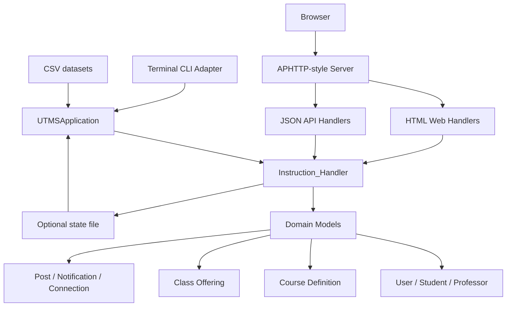
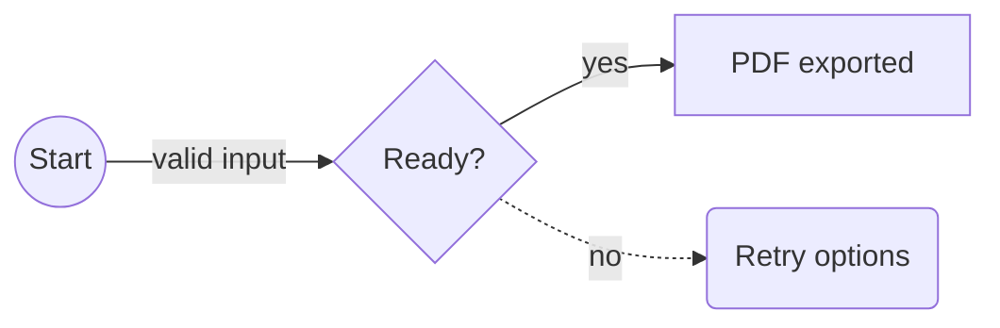

# معرفی

برنامه Mardas MD2PDF ابزاری برای تبدیل Markdown به PDF است که مخصوص سندهای فارسی، انگلیسی و ترکیبی طراحی شده است. هدف پروژه این است که نویسنده بتواند متن را در قالب ساده Markdown بنویسد، اما خروجی نهایی شبیه یک سند PDF مرتب، حرفه‌ای و قابل انتشار باشد.

این پروژه برای گزارش‌های دانشگاهی، مستندات فنی، جزوه‌های آموزشی، راهنماهای نرم‌افزاری، پیش‌نویس‌های پژوهشی، گزارش پروژه و هر سند Markdown که نیاز به خروجی PDF تمیز دارد مناسب است.

```text
Markdown -> HTML ساختاریافته -> PDF با Chromium
```

در این پروژه متن‌ها مستقیماً روی canvas فایل PDF رسم نمی‌شوند. ابتدا Markdown به HTML ساختاریافته تبدیل می‌شود، سپس CSS چاپی و تنظیمات theme اعمال می‌شود، فرمول‌ها با MathJax رندر می‌شوند و در مرحله آخر Chromium خروجی PDF را تولید می‌کند. این روش باعث پشتیبانی بهتر از layout چاپی، متن‌های ترکیبی RTL/LTR، فرمول‌های SVG، کدهای هایلایت‌شده، تصویرهای محلی و جدول‌های پیچیده می‌شود.

> [!NOTE]
> این راهنما هم مستند استفاده است و هم نمونه رندر. نسخه PDF همین فایل در پوشه `examples/` قرار دارد تا کاربر بتواند خروجی واقعی هر قابلیت مهم را بررسی کند.

## چک‌لیست نمونه‌های رندر

این راهنما عمداً چند نمونه کوچک اما مهم دارد تا کنار راهنمای برنامه، مثل test case تصویری هم عمل کند. وقتی PDF خروجی را بررسی می‌کنید، این موارد را ببینید:

| بخش نمونه | چیزی که باید در PDF بررسی شود |
| :--- | :--- |
| جلد و metadata | عنوان، زیرعنوان، نویسنده‌ها، خلاصه، نسخه، وضعیت، کلیدواژه و labelهای وابسته به زبان. |
| فهرست مطالب | شماره‌گذاری تودرتو و لینک‌های ساخته‌شده از headingهای Markdown. |
| متن ترکیبی | متن فارسی/English، inline code و شناسه‌ها در یک پاراگراف خوانا بمانند. |
| فرمول MathJax | فرمول درون‌خطی با متن هماهنگ باشد و فرمول نمایشی وسط‌چین و خوش‌اندازه دیده شود. |
| بلوک کد | fenced، indented و code block بدون زبان بدون خراب شدن محتوا رندر شوند. |
| نمودار Mermaid | بلوک کد از نوع `flowchart` به جای نمایش کد خام، به نمودار SVG تبدیل شود. |
| تصویر و HTML | تصویر Markdown و تگ امن HTML در PDF دیده شوند. |
| پانویس و صفحه‌بندی | پانویس چندخطی، شکست صفحه دستی، marginها و شماره صفحه پایدار باشند. |

## قابلیت‌های اصلی

| قابلیت | توضیح |
| :--- | :--- |
| سندهای فارسی و انگلیسی | پشتیبانی از `lang: fa`، `lang: en`، جهت RTL/LTR و متن ترکیبی. |
| جلد حرفه‌ای | عنوان، زیرعنوان، نویسنده‌ها، خلاصه، لوگو، تاریخ، نسخه، وضعیت، کلیدواژه و metadata آموزشی. |
| فهرست مطالب | ساخت فهرست چندسطحی از headingهای Markdown. |
| فرمول MathJax | رندر فرمول‌های درون‌خطی و نمایشی. |
| بلوک کد | هایلایت کدهای fenced و indented با Pygments. |
| نمودار Mermaid | رندر آفلاین نمودارهای کاربردی `flowchart` / `graph` به صورت SVG. |
| تصویر محلی | جاسازی تصویرهای Markdown و HTML امن به صورت data URI. |
| کد HTML امن | پاک‌سازی HTML خام به صورت پیش‌فرض. |
| پانویس | پشتیبانی از پانویس‌های چندخطی با محتوای Markdown. |
| انواع Theme و profile | قالب‌های `github`، `modern`، `textbook-light`، `textbook-dark` و `academic` همراه با profileهای آماده. |
| اتوماسیون | رابط CLI مناسب برای اسکریپت‌ها و CI. |
| رابط گرافیکی GUI | رابط گرافیکی محلی برای ویرایش، پیش‌نمایش تقریبی، تنظیم گزینه‌ها و خروجی گرفتن. |

# نصب

## پیش‌نیازها

برای استفاده از پروژه بهتر است این موارد آماده باشند:

- نصب بودن Python نسخه 3.10 یا جدیدتر؛
- محیط مجازی Python؛
- نصب بودن Chromium مربوط به Playwright؛
- فونت مناسب فارسی، ترجیحاً Vazirmatn؛
- نصب بودن Git برای clone کردن پروژه.

## نصب از سورس

```bash
git clone https://github.com/mragetsars/Mardas-MD2PDF.git
cd Mardas-MD2PDF
python -m venv .venv
source .venv/bin/activate
pip install -e .
python -m playwright install chromium
```

در Windows PowerShell:

```powershell
python -m venv .venv
.venv\Scripts\Activate.ps1
pip install -e .
python -m playwright install chromium
```

## نصب برای توسعه

برای توسعه و اجرای تست‌ها:

```bash
pip install -e .[dev]
pytest
```

بعد از نصب، دو دستور اصلی در دسترس است:

| دستور | کاربرد |
| :--- | :--- |
| `mrs-md2pdf` | تبدیل Markdown به PDF از خط فرمان. |
| `mrs-md2pdf-gui` | اجرای رابط گرافیکی محلی. |

# اولین خروجی PDF

تبدیل ساده:

```bash
mrs-md2pdf input.md -o output.pdf
```

تبدیل همراه با فهرست مطالب و theme مدرن:

```bash
mrs-md2pdf input.md -o output.pdf --toc --profile github
```

تولید خروجی طولانی با رفتار شبیه کتاب:

```bash
mrs-md2pdf input.md -o output.pdf \
  --toc \
  --toc-depth 4 \
  --toc-page-break \
  --h1-page-break \
  --profile minimal
```

ذخیره HTML میانی برای بررسی و رفع اشکال:

```bash
mrs-md2pdf input.md -o output.pdf --debug-html output.html
```

نمایش صریح progress bar در ترمینال:

```bash
mrs-md2pdf input.md -o output.pdf --progress on
```

حالت پیش‌فرض `--progress auto` فقط وقتی progress bar را نشان می‌دهد که دستور در ترمینال تعاملی اجرا شود. برای اسکریپت‌های ساکت‌تر می‌توانید از `--progress off` استفاده کنید.

# روند پیشنهادی کار

برای رسیدن به خروجی تمیز، این روند پیشنهاد می‌شود:

1. محتوای سند را در Markdown بنویسید.
2. در ابتدای فایل، front matter شامل عنوان، نویسنده، زبان، جهت و metadata جلد را اضافه کنید.
3. یک خروجی اولیه با `--toc` و theme مناسب بگیرید.
4. جلد، فهرست مطالب، صفحه‌های دارای فرمول، صفحه‌های دارای کد، تصویرها و شماره صفحه را بررسی کنید.
5. اگر layout نیاز به بررسی داشت، خروجی `--debug-html` بگیرید و HTML تولیدشده را در مرورگر ببینید.
6. اصلاحات نهایی را در Markdown انجام دهید و PDF را دوباره بسازید.

برای سندهای مهم، بررسی انسانی خروجی نهایی ضروری است. تست خودکار بسیاری از خطاها را می‌گیرد، اما تایپوگرافی، شکست صفحه و فاصله‌ها باید دیده شوند.

# درباره Front Matter

بخش Front matter یک بخش YAML اختیاری در ابتدای فایل Markdown است. این بخش جلد، metadata فایل PDF، زبان سند، جهت سند و چند فیلد مخصوص گزارش‌های رسمی یا آموزشی را کنترل می‌کند.

```yaml
---
title: "گزارش فنی من"
subtitle: "یک سند PDF ساخته‌شده با Markdown"
authors:
  - name: "Mardas"
    email: "mragetsars@gmail.com"
    affiliation: "Mardas Lab"
    role: "Author"
summary: |
  این متن روی جلد نمایش داده می‌شود.
  متن چندخطی پشتیبانی می‌شود.
institution: "نام دانشگاه یا سازمان"
department: "نام دانشکده یا دپارتمان"
course: "نام درس یا پروژه"
supervisor: "نام استاد یا راهنما"
date: "۱۴۰۵-۰۲-۳۰"
version: "1.5.1"
status: "Draft"
keywords: [Markdown, PDF, RTL, MathJax]
cover_label: "گزارش فنی"
cover_logo: "src/assets/Mardas.png"
lang: fa
dir: rtl
---
```

## فیلدهای رایج

| فیلد | کاربرد |
| :--- | :--- |
| `title` | عنوان جلد و title در metadata فایل PDF. |
| `subtitle` | متن اختیاری زیر عنوان اصلی. |
| `author` | نویسنده ساده و تک‌مقداری. |
| `authors` | فهرست نویسنده‌ها با `name`، `email`، `affiliation` و `role`. |
| `summary` / `description` | خلاصه روی جلد و subject در metadata. |
| `institution`, `department`, `course` | اطلاعات دانشگاهی یا سازمانی. |
| `supervisor`, `group`, `student_id` | فیلدهای اختیاری برای گزارش‌های آموزشی. |
| `date`, `version`, `status` | کارت‌های وضعیت سند روی جلد. |
| `keywords` / `tags` | کلیدواژه‌های جلد و metadata فایل PDF. |
| `cover_label` | برچسب کوچک بالای عنوان جلد. |
| `cover_logo` / `logo` | مسیر لوگوی سفارشی نسبت به فایل Markdown. |
| `lang` | زبان داخلی رابط سند، معمولاً `fa` یا `en`. |
| `dir` | جهت پوسته سند: `auto`، `ltr` یا `rtl`. |

## رفتار جلد

جلد جدا از محتوای اصلی رندر می‌شود. نتیجه این تصمیم چنین است:

- جلد جزو شماره صفحات محتوایی حساب نمی‌شود؛
- شماره‌گذاری footer از صفحه بعد از جلد شروع می‌شود؛
- طرح watermark فقط روی صفحات محتوایی اعمال می‌شود؛
- قالب theme می‌تواند برای جلد پس‌زمینه تمام‌صفحه داشته باشد؛
- در صورت نیاز، جلد کاملاً قابل حذف است.

حذف جلد:

```bash
mrs-md2pdf input.md -o output.pdf --no-cover
```

استفاده از لوگوی سفارشی:

```bash
mrs-md2pdf input.md -o output.pdf --cover-logo ./src/assets/Mardas.png
```

حفظ جلد بدون نمایش لوگو:

```bash
mrs-md2pdf input.md -o output.pdf --no-cover-logo
```

# زبان و جهت سند

کنترل جهت یکی از مهم‌ترین بخش‌های تولید PDF فارسی/انگلیسی است. در Mardas MD2PDF زبان سند و جهت سند از هم جدا در نظر گرفته شده‌اند.

`lang: fa` باعث ایجاد پوسته فارسی/RTL، لیبل‌های فارسی جلد، عنوان فارسی calloutها و عنوان `فهرست مطالب` می‌شود.

`lang: en` باعث ایجاد پوسته انگلیسی/LTR، لیبل‌های انگلیسی جلد، عنوان انگلیسی calloutها و عنوان `Table of Contents` می‌شود.

## اولویت تعیین جهت

جهت سند با این ترتیب مشخص می‌شود:

1. گزینه خط فرمان `--dir rtl|ltr|auto`
2. فیلدهای front matter مثل `dir`، `direction`، `text_direction` یا `document_direction`
3. پیش‌فرض به‌دست‌آمده از `lang`
4. تشخیص خودکار از متن Markdown

## نمونه متن ترکیبی

در متن انگلیسی می‌توان واژه‌های فارسی مثل راست به چپ، فونت فارسی و گزارش فنی را آورد بدون اینکه جمله انگلیسی به هم بریزد.

در متن فارسی نیز می‌توان شناسه‌های English مثل `Playwright`، `MathJax`، `GitHub Actions`، `PDF` و `RTL/LTR` را داخل همان پاراگراف استفاده کرد.

همچنین Inline code هم پایدار می‌ماند: `mrs-md2pdf input.md -o output.pdf --toc`.

# فهرست مطالب

فعال کردن فهرست مطالب:

```bash
mrs-md2pdf input.md -o output.pdf --toc
```

تعیین عمق فهرست:

```bash
mrs-md2pdf input.md -o output.pdf --toc --toc-depth 3
```

شروع متن اصلی از صفحه جدید بعد از فهرست:

```bash
mrs-md2pdf input.md -o output.pdf --toc --toc-page-break
```

شروع هر heading سطح اول از صفحه جدید:

```bash
mrs-md2pdf input.md -o output.pdf --h1-page-break
```

فهرست مطالب از headingهای Markdown ساخته می‌شود و فرمول‌های درون‌خطی داخل headingها مثل $E = mc^2$ و $\epsilon$ را خوانا نگه می‌دارد.

# مرجع امکانات Markdown

## پاراگراف و تاکید

پاراگراف‌های Markdown، **متن bold**، *متن italic*، `inline code`، لینک، لیست مرتب، لیست نامرتب، task list و نقل‌قول پشتیبانی می‌شوند.

## لیست‌ها

- نوشتن محتوای اصلی با Markdown.
- افزودن front matter برای metadata.
- انتخاب theme مناسب.
- بررسی خروجی نهایی PDF.

1. نصب پکیج.
2. نصب Chromium.
3. اجرای CLI.
4. بررسی خروجی.

## فهرست وظایف

- [x] ورودی Markdown
- [x] تایپوگرافی فارسی/English
- [x] رندر MathJax
- [x] هایلایت کد
- [ ] بازبینی انسانی نهایی

## جدول

| قابلیت | وضعیت | توضیح |
| :--- | :---: | :--- |
| متن ترکیبی RTL/LTR | بله | پاراگراف، heading، لیست و سلول جدول با direction-aware styling رندر می‌شوند. |
| تصویر محلی | بله | تصویرهای Markdown و HTML امن در صورت امکان embed می‌شوند. |
| فرمول MathJax | بله | فرمول درون‌خطی و نمایشی اندازه‌گذاری جدا دارند. |
| هایلایت کد | بله | برای fenced و indented code block از Pygments استفاده می‌شود. |
| نمودار Mermaid | بله | fenceهای کاربردی `flowchart` و `graph` به نمودار SVG تبدیل می‌شوند. |
| پانویس | بله | پانویس چندخطی با Markdown داخلی پشتیبانی می‌شود. |
| کد HTML خام امن | بله | tagها و event handlerهای خطرناک حذف می‌شوند. |

## نقل‌قول

> کیفیت خروجی PDF فقط تبدیل متن نیست. تایپوگرافی، line height، کنتراست، صفحه‌بندی، تصویرها، فرمول‌ها و قابل پیش‌بینی بودن رندر اهمیت دارند.

## انواع Callout

انواع Calloutها از markerهای مشابه GitHub استفاده می‌کنند و عنوان آن‌ها با توجه به زبان سند ترجمه می‌شود.

> [!NOTE]
> برای نکته‌های توضیحی که باید از متن اصلی جدا دیده شوند، از callout استفاده کنید.

> [!TIP]
> وقتی لازم است HTML دقیق ارسال‌شده به Chromium را ببینید، از `--debug-html output.html` استفاده کنید.

> [!WARNING]
> گزینه `--unsafe-html` فقط برای فایل‌های محلی قابل اعتماد مناسب است، چون sanitizer داخلی را غیرفعال می‌کند.

# فرمول‌های MathJax

فرمول‌های درون‌خطی باید با ارتفاع خط اطراف هماهنگ باشند: $E = mc^2$، $T = 500$ و $\Sigma = I \cdot \epsilon$ باید طبیعی وسط جمله قرار بگیرند.

فرمول نمایشی فضای بیشتری می‌گیرد:

$$
\int_{-\infty}^{\infty} e^{-x^2}\,dx = \sqrt{\pi}
$$

نمونه ماتریسی:

$$
A = \begin{bmatrix}
1 & 2 \\
3 & 4
\end{bmatrix}, \qquad \det(A) = -2
$$

نمونه aligned:

$$
\begin{aligned}
\text{precision} &= \frac{TP}{TP + FP} \\
\text{recall} &= \frac{TP}{TP + FN}
\end{aligned}
$$

## رفع اشکال فرمول‌ها

اگر فرمول‌ها به شکل TeX خام دیده شدند:

- مطمئن شوید `--no-mathjax` استفاده نشده باشد؛
- هشدارهای ترمینال را بررسی کنید؛
- برای سندهای خیلی بزرگ مقدار timeout مرورگر را افزایش دهید؛
- یک فایل کوچک‌تر بسازید تا فرمول مشکل‌دار را جدا کنید.

# بلوک‌های کد

بلوک‌های کد fenced از برجسته‌سازی نحوی و برچسب زبان پشتیبانی می‌کنند.

```python
from dataclasses import dataclass

@dataclass
class Document:
    title: str
    lang: str = "fa"


def render_message(doc: Document) -> str:
    return f"Rendering {doc.title} as PDF"

print(render_message(Document("راهنمای Mardas")))
```

```javascript
const items = ["Markdown", "Persian", "English", "MathJax", "PDF"];
const message = items.map((item, index) => `${index + 1}. ${item}`).join("\n");
console.log(message);
```

بلوک کد fenced بدون زبان هم معتبر است:

```
این بلوک زبان مشخصی ندارد.
با این حال باید بدون خطا رندر شود.
```

همچنین indented code block نیز پشتیبانی می‌شود:

    SELECT title, lang, version
    FROM documents
    WHERE renderer = 'mardas-md2pdf';

توجه کنید که inline code در برابر پردازش فرمول و پانویس محافظت می‌شود. یعنی `$x$` و `[^note]` وقتی داخل backtick باشند، به شکل literal باقی می‌مانند.

## بلوک‌های کد پیشرفته

برای آموزش، بازبینی کد یا مستندات فنی، بلوک‌های کد می‌توانند عنوان فایل، شماره خط و خطوط برجسته‌شده داشته باشند.

````md
```python title="renderer.py" {2,5-6} linenos
def convert(markdown: str) -> bytes:
    html = render_markdown(markdown)
    pdf = render_pdf(html)
    return pdf
```
````

نمونه بالا در PDF به شکل یک بلوک کد با caption سفارشی، شماره خط و highlight رندر می‌شود:

```python title="renderer.py" {2,5-6} linenos
def convert(markdown: str) -> bytes:
    html = render_markdown(markdown)
    pdf = render_pdf(html)
    return pdf
```

# نمودارهای Mermaid

بلوک‌های Mermaid برای flowchart به صورت SVG در HTML میانی رندر می‌شوند و بعد داخل PDF قرار می‌گیرند. تمرکز renderer فعلاً روی زیرمجموعه رایج در مستندات پروژه است: `flowchart` / `graph`، جهت‌های `TD`، `TB`، `BT`، `LR`، `RL`، nodeهای مستطیلی، گرد، دایره‌ای و لوزی، edgeهای ساده، dotted، ضخیم و edgeهای دارای label.

نکته مهم در خروجی PDF این است که بلوک زیر باید به شکل نمودار دیده شود، نه کد خام:



این نمونه کوچک‌تر برای بررسی label روی edgeها و شکل nodeها مفید است:



اگر یک بلوک Mermaid از syntaxهای پیشرفته خارج از این زیرمجموعه استفاده کند، بهتر است تا زمان اضافه‌شدن آن قابلیت، یک تصویر fallback کوچک از همان نمودار کنار Markdown نگه داشته شود. برای معماری‌های معمول، data flow و نمودارهای آموزشی، renderer داخلی کافی است و به اینترنت نیاز ندارد.

# تصویر و HTML امن

مسیر تصویرها نسبت به فایل Markdown resolve می‌شود. تصویرهای محلی اگر حجم مناسبی داشته باشند داخل HTML/PDF نهایی embed می‌شوند.


وقتی اندازه‌دهی دقیق‌تر لازم است، می‌توان از HTML امن استفاده کرد:


## قواعد استفاده از تصویر

- برای خروجی پایدار PDF، تصویرهای محلی بهتر از تصویرهای remote هستند.
- قبل از embed کردن، حجم تصویرها را منطقی نگه دارید.
- مسیر تصویر را نسبت به محل فایل Markdown بنویسید.
- مسیر تصویر را داخل پوشه همان سند نگه دارید. مسیرهای absolute، URLهای `file:`، خروج از پوشه با الگوهایی مثل `../secret.png` و fallback به current working directory به صورت پیش‌فرض embed نمی‌شوند.
- در GUI، فایل‌ها یا پوشه تصویر را قبل از export attach کنید.
- تصویرهای خیلی بزرگ embed نمی‌شوند و renderer برای جلوگیری از مصرف زیاد حافظه هشدار می‌دهد.

## کد HTML امن

کد HTML خام به صورت پیش‌فرض sanitize می‌شود. sanitizer عناصر مناسب سند مثل `<div>`، `<span>`، `<table>`، `<figure>` و `` را نگه می‌دارد، اما محتوای فعال یا خطرناک مثل script، event handler، iframe، form، stylesheet خارجی، URLهای `file:` و URL scheme ناامن را حذف می‌کند.

غیرفعال کردن sanitizer فقط برای فایل‌های قابل اعتماد:

```bash
mrs-md2pdf input.md -o output.pdf --unsafe-html
```

<div class="md2pdf-page-break"></div>

# صفحه‌بندی و Layout

## شکست صفحه دستی

برای شکست صفحه دستی می‌توانید HTML امن زیر را قرار دهید:

```html
<div class="md2pdf-page-break"></div>
```

## اندازه صفحه

استفاده از اندازه نام‌دار:

```bash
mrs-md2pdf input.md -o output.pdf --page-size A4
```

استفاده از حالت landscape:

```bash
mrs-md2pdf input.md -o output.pdf --page-size "A4 landscape"
```

استفاده از ابعاد دقیق:

```bash
mrs-md2pdf input.md -o output.pdf --page-size "210mm 297mm"
```

## انواع Margin

```bash
mrs-md2pdf input.md -o output.pdf \
  --margin-top 18mm \
  --margin-bottom 18mm \
  --margin-x 16mm
```

# اعمال Watermark

اعمال Watermark متنی:

```bash
mrs-md2pdf input.md -o output.pdf --watermark "DRAFT"
```

اعمال Watermark تصویری:

```bash
mrs-md2pdf input.md -o output.pdf \
  --watermark-image ./src/assets/Mardas.png \
  --watermark-opacity 0.05 \
  --watermark-width 95mm
```

طرح Watermark فقط روی صفحات محتوایی اعمال می‌شود و روی جلد قرار نمی‌گیرد.

# انواع Theme

برنامه Mardas MD2PDF چند theme داخلی و profile آماده دارد. Profileها پیش‌فرض‌های مناسب برای نوع سند را انتخاب می‌کنند و themeها ظاهر CSS را کنترل می‌کنند.

| Theme | کاربرد پیشنهادی |
| :--- | :--- |
| `github` | مستندات پروژه‌ای شبیه README و خروجی نزدیک به GitHub-style Markdown. |
| `modern` | مستندات عمومی، proposal، گزارش نرم‌افزاری و راهنمای محصول. |
| `textbook-light` | جزوه‌های آموزشی طولانی و محتوای آموزشی فارسی/English. |
| `textbook-dark` | مطالعه روی صفحه، بررسی در محیط کم‌نور و یادداشت‌های فنی شبیه ارائه. |
| `academic` | گزارش رسمی، سند دانشگاهی، پیش‌نویس پایان‌نامه و مقاله ساختاریافته. |

انتخاب profile یا theme:

```bash
mrs-md2pdf input.md -o output.pdf --profile github
mrs-md2pdf input.md -o output.pdf --theme academic
```

# روند کار با GUI

اجرای GUI:

```bash
mrs-md2pdf-gui
```

رابط کاربری GUI برای کاربرانی مناسب است که روند بصری را ترجیح می‌دهند:

1. نوشتن یا paste کردن Markdown.
2. انتخاب theme، زبان، جهت، اندازه صفحه و گزینه‌های خروجی.
3. امکان attach کردن فایل‌ها یا پوشه‌های تصویر محلی.
4. دیدن پیش‌نمایش تقریبی.
5. در آخر export گرفتن از PDF نهایی.

> [!IMPORTANT]
> پیش‌نمایش داخل GUI تقریبی است. PDF نهایی توسط backend renderer ساخته می‌شود و پردازش کامل Markdown، CSS theme، MathJax، جلد و layout چاپی Chromium روی آن اعمال می‌شود.

# مرجع CLI

| گزینه | توضیح |
| :--- | :--- |
| `input` | فایل Markdown ورودی. |
| `-o`, `--output` | مسیر PDF خروجی. |
| `--title`, `--author`, `--description` | override کردن metadata موجود در front matter. |
| `--toc`, `--toc-depth` | فعال‌سازی و تنظیم فهرست مطالب. |
| `--toc-page-break`, `--h1-page-break` | کنترل صفحه‌بندی چاپی. |
| `--profile` | انتخاب `default`، `github`، `academic`، `persian-report` یا `minimal`. |
| `--theme` | انتخاب `modern`، `github`، `textbook-light`، `textbook-dark` یا `academic`. اگر داده شود، theme انتخاب‌شده توسط profile را override می‌کند. |
| `--page-size` | اندازه صفحه مثل `A4`، `Letter`، `Legal`، `A4 landscape` یا ابعادی مثل `210mm 297mm`. |
| `--dir` | اجبار جهت به `auto`، `ltr` یا `rtl`. |
| `--margin-top`, `--margin-bottom`, `--margin-x` | کنترل margin صفحه. |
| `--font-dir` | مسیر فونت‌های محلی Vazirmatn. |
| `--chromium-path` | مسیر سفارشی Chromium یا Chrome. |
| `--debug-html` | ذخیره HTML میانی. |
| `--no-cover`, `--cover-logo`, `--no-cover-logo` | تنظیم جلد. |
| `--watermark`, `--watermark-image` | افزودن watermark متنی یا تصویری. |
| `--no-header-footer` | حذف footer چاپی. |
| `--no-mathjax` | غیرفعال کردن MathJax. |
| `--unsafe-html` | غیرفعال کردن sanitization برای فایل‌های قابل اعتماد. |
| `--timeout-ms` | timeout مرورگر بر حسب میلی‌ثانیه. |
| `--progress` | حالت progress bar ترمینال: `auto`، `on` یا `off`. مقدار پیش‌فرض: `auto`. |

برای دیدن همه گزینه‌ها:

```bash
mrs-md2pdf --help
```

# اتوماسیون و CI

یک دستور ساده برای ساخت PDF در اسکریپت:

```bash
mrs-md2pdf docs/report.md -o build/report.pdf --toc --theme modern
```

مخزن شامل workflow گیت‌هاب Actions است که Ruff، pytest و یک smoke test واقعی رندر با Chromium را روی نسخه‌های پشتیبانی‌شده Python اجرا می‌کند. برای CI بهتر است گزینه‌ها صریح باشند:

```bash
mrs-md2pdf docs/report.md -o build/report.pdf \
  --toc \
  --toc-depth 4 \
  --theme modern \
  --page-size A4 \
  --dir auto \
  --timeout-ms 60000 \
  --progress off
```

برای اشکال‌زدایی در CI، HTML میانی را به عنوان artifact نگه دارید:

```bash
mrs-md2pdf docs/report.md -o build/report.pdf --debug-html build/report.html
```

# رفع اشکال

## پیدا نشدن Chromium

این دستور را اجرا کنید:

```bash
python -m playwright install chromium
```

یا مسیر مرورگر را صریح بدهید:

```bash
mrs-md2pdf input.md -o output.pdf --chromium-path /path/to/chrome
```

## متن فارسی ظاهر مناسبی ندارد

یک فونت فارسی مناسب مثل Vazirmatn نصب کنید یا مسیر فونت را بدهید:

```bash
mrs-md2pdf input.md -o output.pdf --font-dir ./fonts
```

اگر مسیر فونت وجود نداشته باشد یا فایل شناخته‌شده‌ای داخل آن پیدا نشود، renderer هشدار می‌دهد و از فونت‌های سیستم استفاده می‌کند.

## تصویرها دیده نمی‌شوند

مطمئن شوید مسیر تصویرها نسبت به فایل Markdown درست است و داخل پوشه همان سند باقی می‌ماند. مسیرهای absolute، URLهای `file:` و خروج از پوشه با `..` به جای embed شدن، به شکل لینک باقی می‌مانند. اگر از GUI استفاده می‌کنید، فایل‌ها یا پوشه‌های تصویر را قبل از خروجی گرفتن attach کنید. تصویرهای خیلی بزرگ embed نمی‌شوند و هشدار تولید می‌کنند.

## فرمول‌ها به شکل TeX خام دیده می‌شوند

مطمئن شوید MathJax فعال است و هشدارهای renderer را بررسی کنید. برای سندهای بزرگ مقدار timeout را افزایش دهید:

```bash
mrs-md2pdf input.md -o output.pdf --timeout-ms 90000
```

## نیاز به بررسی Layout

فایل HTML میانی را ذخیره کنید:

```bash
mrs-md2pdf input.md -o output.pdf --debug-html output.html
```

سپس `output.html` را در مرورگر باز کنید و ساختار و CSS تولیدشده را بررسی کنید.

# پانویس

پانویس برای ارجاع، یادداشت فنی و توضیح تکمیلی مناسب است.[^pipeline]

[^pipeline]: برنامه Mardas MD2PDF به‌جای رسم مستقیم هر پاراگراف روی canvas فایل PDF، از Chromium برای layout استفاده می‌کند.
    این انتخاب باعث پشتیبانی بهتر از CSS print، متن ترکیبی، خروجی SVG MathJax، جدول‌ها، تصویرهای محلی و کدهای هایلایت‌شده می‌شود.

    - پانویس چندخطی پشتیبانی می‌شود.
    - متن Markdown داخل پانویس حفظ می‌شود.
    - توجه کنید که inline code مثل `@page`، `$x$` و `[^id]` وقتی داخل backtick نوشته شود خوانا و literal باقی می‌ماند.

# چک‌لیست نهایی انتشار

قبل از انتشار PDF مهم، این موارد را بررسی کنید:

- [x] عنوان جلد، زیرعنوان، نویسنده، تاریخ و metadata.
- [x] زبان و جهت سند.
- [x] عمق و لیبل‌های فهرست مطالب.
- [x] صفحه‌های دارای فرمول.
- [x] صفحه‌های دارای code block و inline code.
- [x] صفحه‌های دارای تصویر محلی.
- [x] جدول‌هایی که محتوای پهن دارند.
- [x] پانویس‌ها و لینک‌ها.
- [x] شماره‌گذاری footer بعد از جلد.
- [ ] بازبینی بصری نهایی در PDF viewer.
- [ ] هنگام انتشار نسخه tag شده، چک‌لیست release در `docs/RELEASE.md` کامل شده باشد.
