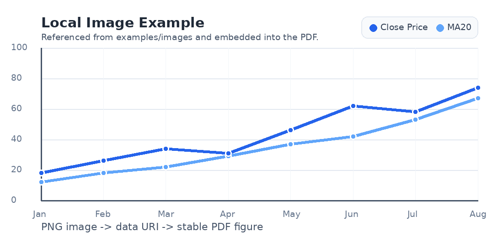

# شروع سریع

Mardas MD2PDF فایل‌های Markdown را با یک مسیر رندر مرورگرمحور به PDF تمیز و حرفه‌ای تبدیل می‌کند:

```text
Markdown -> HTML تایپوگرافیک -> PDF با Chromium
```

این روش باعث می‌شود نوشتن سند ساده بماند، اما خروجی PDF همچنان کنترل دقیق روی تایپوگرافی، جدول، فرمول، تصویر، جلد، فهرست مطالب، شکست صفحه و متن‌های ترکیبی فارسی/English داشته باشد.

> [!NOTE]
> این فایل هم راهنمای استفاده است و هم یک test case بصری. اگر آن را به PDF تبدیل کنید، بیشتر قابلیت‌های پروژه را در یک خروجی واحد می‌بینید.

## نصب

ابتدا پروژه را clone کنید، محیط مجازی بسازید، پکیج را نصب کنید و Chromium مربوط به Playwright را دریافت کنید:

```bash
git clone https://github.com/mragetsars/Mardas-MD2PDF.git
cd Mardas-MD2PDF
python -m venv .venv
source .venv/bin/activate
pip install -e .
python -m playwright install chromium
```

در Windows PowerShell:

```powershell
python -m venv .venv
.venv\Scripts\Activate.ps1
pip install -e .
python -m playwright install chromium
```

برای توسعه و اجرای تست‌ها:

```bash
pip install -e .[dev]
pytest
```

## اولین خروجی PDF

تبدیل ساده:

```bash
mrs-md2pdf input.md -o output.pdf
```

تبدیل همراه با فهرست مطالب:

```bash
mrs-md2pdf input.md -o output.pdf --toc --toc-depth 4 --theme modern
```

خروجی شبیه کتاب، با فهرست مطالب جدا و شروع هر heading سطح اول از صفحه جدید:

```bash
mrs-md2pdf input.md -o output.pdf \
  --toc \
  --toc-depth 4 \
  --toc-page-break \
  --h1-page-break \
  --theme textbook-light
```

## چه زمانی از GUI استفاده کنیم؟

رابط گرافیکی محلی را اجرا کنید:

```bash
mrs-md2pdf-gui
```

GUI برای کاربرانی مناسب است که می‌خواهند Markdown را ویرایش کنند، preview ببینند، theme انتخاب کنند، گزینه‌های خروجی را تنظیم کنند، فایل‌ها یا پوشه تصاویر محلی را attach کنند و بدون حفظ کردن flagهای خط فرمان PDF بگیرند.

# Front Matter و طراحی جلد

Front matter یک بخش YAML اختیاری در ابتدای فایل Markdown است. این بخش اطلاعات جلد، metadata فایل PDF، زبان، جهت سند و جزئیات دیگر را کنترل می‌کند.

```yaml
---
title: "راهنمای کامل Mardas MD2PDF"
subtitle: "آموزش استفاده و معرفی امکانات"
authors:
  - name: "تیم Mardas MD2PDF"
    role: "مستندسازی"
  - name: "Meraj Rastegar"
    email: "mragetsars@yahoo.com"
summary: |
  متن چندخطی summary روی جلد حفظ می‌شود.
  خط خالی، پاراگراف جدا ایجاد می‌کند.
institution: "آزمایشگاه Mardas"
version: "1.3.1"
keywords: [Markdown, PDF, RTL/LTR, MathJax]
cover_label: "راهنمای کامل"
lang: fa
dir: rtl
---
```

## فیلدهای رایج

| فیلد | کاربرد |
| :--- | :--- |
| `title` | عنوان جلد و عنوان metadata فایل PDF. |
| `subtitle` | متن اختیاری زیر عنوان اصلی. |
| `author` / `authors` | یک نویسنده یا چند نویسنده. هر author object می‌تواند `name`، `email`، `affiliation` و `role` داشته باشد. |
| `summary` / `description` | خلاصه روی جلد و subject metadata. متن چندخطی YAML پشتیبانی می‌شود. |
| `date`، `version`، `status` | کارت‌های اختیاری روی جلد. |
| `institution`، `course`، `department`، `supervisor`، `group`، `student_id` | کارت‌های اختیاری برای گزارش‌ها و اسناد آموزشی. |
| `keywords` / `tags` | کارت کلیدواژه‌ها و metadata فایل PDF. |
| `cover_label` | نوشته کوچک بالای عنوان جلد. |
| `cover_logo` / `logo` | مسیر لوگوی سفارشی نسبت به فایل Markdown. |
| `lang` | زبان UI داخلی مثل `fa` یا `en`. |
| `dir` | جهت پوسته سند: `auto`، `rtl` یا `ltr`. |

## رفتار جلد

جلد جدا از محتوای اصلی رندر می‌شود. بنابراین:

- جلد در شماره‌گذاری صفحات محتوا حساب نمی‌شود؛
- footer از صفحه بعد از جلد شروع می‌شود؛
- watermark روی جلد اعمال نمی‌شود؛
- پس‌زمینه جلد می‌تواند تمام صفحه را بپوشاند.

حذف جلد:

```bash
mrs-md2pdf input.md -o output.pdf --no-cover
```

استفاده از لوگوی سفارشی:

```bash
mrs-md2pdf input.md -o output.pdf --cover-logo ./assets/logo.png
```

مخفی کردن لوگو اما حفظ ساختار جلد:

```bash
mrs-md2pdf input.md -o output.pdf --no-cover-logo
```

# زبان، جهت و تایپوگرافی

`lang: fa` باعث می‌شود پوسته سند RTL شود، لیبل‌های جلد فارسی شوند، عنوان فهرست مطالب `فهرست مطالب` باشد و calloutها عنوان فارسی بگیرند. `lang: en` سند را LTR می‌کند و لیبل‌های انگلیسی مثل `Table of Contents` و `Note` را به کار می‌برد.

ترتیب تصمیم‌گیری برای جهت سند:

1. گزینه خط فرمان `--dir rtl|ltr|auto`
2. فیلدهای front matter مثل `dir`، `direction`، `text_direction` یا `document_direction`
3. پیش‌فرضی که از `lang` به دست می‌آید
4. تشخیص خودکار از متن Markdown

## نمونه متن ترکیبی

در یک پاراگراف فارسی می‌توان از عبارت‌های English مثل `Playwright`، `MathJax`، `PDF`، `GitHub Actions` و `RTL/LTR` استفاده کرد بدون اینکه ترتیب متن به هم بریزد. همین‌طور در یک متن انگلیسی می‌توان واژه‌های فارسی مثل راست‌چین، فونت فارسی و گزارش فنی را آورد.

Inline code هم خوانا باقی می‌ماند: `mrs-md2pdf input.md -o output.pdf --toc`.

## نکته‌های کنترل جهت

- برای اسناد فارسی از `lang: fa` استفاده کنید.
- برای اسناد انگلیسی از `lang: en` استفاده کنید.
- وقتی می‌خواهید برنامه خودش تصمیم بگیرد، `dir: auto` مناسب است.
- در pipelineهای خودکار می‌توانید با `--dir ltr` یا `--dir rtl` جهت را صریح کنید.

# فهرست مطالب

فعال کردن فهرست مطالب:

```bash
mrs-md2pdf input.md -o output.pdf --toc
```

تعیین عمق headingها:

```bash
mrs-md2pdf input.md -o output.pdf --toc --toc-depth 3
```

شروع متن اصلی از صفحه جدید بعد از فهرست:

```bash
mrs-md2pdf input.md -o output.pdf --toc --toc-page-break
```

فهرست مطالب از headingهای Markdown ساخته می‌شود و اگر عنوان‌ها فرمول درون‌خطی مثل $E = mc^2$ یا $\epsilon$ داشته باشند، MathJax آن‌ها را به‌صورت قابل خواندن رندر می‌کند.

# امکانات Markdown

## جدول

| قابلیت | وضعیت | توضیح |
| :--- | :---: | :--- |
| متن ترکیبی RTL/LTR | ✅ | پاراگراف، عنوان، آیتم لیست و سلول جدول direction-aware می‌شوند. |
| تصویر محلی | ✅ | تصویرهای Markdown و HTML امن به data URI تبدیل می‌شوند. |
| MathJax | ✅ | فرمول درون‌خطی و نمایشی اندازه‌گذاری جدا دارند. |
| هایلایت کد | ✅ | fenced code block و indented code block با Pygments رندر می‌شوند. |
| پانویس | ✅ | پانویس چندخطی با Markdown داخلی پشتیبانی می‌شود. |
| HTML امن | ✅ | tagها و attributeهای خطرناک به‌صورت پیش‌فرض حذف می‌شوند. |

## Task list

- [x] نوشتن Markdown.
- [x] تنظیم front matter.
- [x] تولید PDF.
- [ ] بررسی نهایی خروجی در PDF viewerهای مختلف برای اسناد مهم.

## نقل‌قول

> کیفیت خروجی PDF فقط تبدیل متن نیست؛ تایپوگرافی، فاصله‌ها، کنتراست، رفتار صفحه‌بندی و پایداری تصویرها هم اهمیت دارند.

## Calloutها

> [!TIP]
> وقتی لازم است HTML نهایی را بررسی کنید، از `--debug-html output.html` استفاده کنید.

> [!WARNING]
> گزینه `--unsafe-html` فقط برای فایل‌های کاملاً قابل اعتماد مناسب است، چون sanitizer داخلی را غیرفعال می‌کند.

# فرمول‌های MathJax

فرمول‌های درون‌خطی باید هم‌اندازه متن اطراف باشند: $E = mc^2$، $\Sigma = I \cdot \epsilon$ و $T = 500$ باید طبیعی وسط جمله قرار بگیرند.

فرمول نمایشی فضای بیشتری می‌گیرد و بزرگ‌تر و خواناتر نمایش داده می‌شود:

$$
\int_{-\infty}^{\infty} e^{-x^2}\,dx = \sqrt{\pi}
$$

نمونه ماتریسی:

$$
A = \begin{bmatrix}
1 & 2 \\
3 & 4
\end{bmatrix}, \qquad \det(A) = -2
$$

نمونه aligned:

$$
\begin{aligned}
\text{precision} &= \frac{TP}{TP + FP} \\
\text{recall} &= \frac{TP}{TP + FN}
\end{aligned}
$$

# هایلایت کد

fenced code blockها label زبان و هایلایت syntax دارند.

```python
from dataclasses import dataclass

@dataclass
class Document:
    title: str
    lang: str = "fa"


def render_message(doc: Document) -> str:
    return f"Rendering {doc.title} as a polished PDF"

print(render_message(Document("راهنمای Mardas")))
```

```javascript
const items = ["Markdown", "Persian", "English", "MathJax", "PDF"];
const message = items.map((item, index) => `${index + 1}. ${item}`).join("\n");
console.log(message);
```

```c
int setSeed(void);
int getRandomNumber(int n, int *buf);
int process_information(int pid);
int sort_numbers(const char *src_file);
```

Indented code block هم پشتیبانی می‌شود:

    SELECT title, lang, version
    FROM documents
    WHERE renderer = 'mardas-md2pdf';

# تصویر و HTML امن

تصویرهای Markdown نسبت به مسیر فایل Markdown resolve می‌شوند و داخل HTML/PDF نهایی جاسازی می‌شوند.



وقتی اندازه‌دهی دقیق‌تر لازم است، می‌توان از HTML امن استفاده کرد:


HTML خام به‌صورت پیش‌فرض sanitize می‌شود. sanitizer عناصر مناسب سند مثل `<div>`، `<span>`، `<table>`، `<figure>` و `` را نگه می‌دارد و محتوای فعال مثل script، event handler، iframe، form، stylesheet خارجی و URL scheme ناامن را حذف می‌کند.

<div class="md2pdf-page-break"></div>

# صفحه‌بندی، Watermark و Themeها

## شکست صفحه دستی

برای شکست صفحه دستی می‌توانید HTML امن زیر را بنویسید:

```html
<div class="md2pdf-page-break"></div>
```

## Watermark

Watermark متنی:

```bash
mrs-md2pdf input.md -o output.pdf --watermark "DRAFT"
```

Watermark تصویری:

```bash
mrs-md2pdf input.md -o output.pdf \
  --watermark-image ./Mardas.png \
  --watermark-opacity 0.05 \
  --watermark-width 95mm
```

Watermark فقط روی صفحات محتوا اعمال می‌شود و روی جلد نمی‌آید.

## Themeها

| Theme | کاربرد پیشنهادی |
| :--- | :--- |
| `modern` | مستندات عمومی، proposal، گزارش نرم‌افزاری. |
| `textbook-light` | جزوه آموزشی و سندهای طولانی فارسی/انگلیسی. |
| `textbook-dark` | مطالعه روی صفحه و بررسی در محیط کم‌نور. |
| `academic` | گزارش رسمی، سند دانشگاهی و پیش‌نویس پایان‌نامه‌مانند. |

# مرجع CLI

| گزینه | توضیح |
| :--- | :--- |
| `input` | فایل Markdown ورودی. |
| `-o`, `--output` | مسیر PDF خروجی. |
| `--title`, `--author`, `--description` | override کردن metadata موجود در front matter. |
| `--toc`, `--toc-depth` | فعال‌سازی و تنظیم فهرست مطالب. |
| `--toc-page-break`, `--h1-page-break` | کنترل صفحه‌بندی چاپی. |
| `--theme` | انتخاب `modern`، `textbook-light`، `textbook-dark` یا `academic`. |
| `--page-size` | اندازه صفحه مثل `A4`، `Letter`، `Legal` یا اندازه CSS. |
| `--dir` | اجبار جهت به `auto`، `ltr` یا `rtl`. |
| `--margin-top`, `--margin-bottom`, `--margin-x` | کنترل margin صفحه. |
| `--font-dir` | مسیر فونت‌های محلی Vazirmatn. |
| `--chromium-path` | مسیر سفارشی Chromium/Chrome. |
| `--debug-html` | ذخیره HTML میانی. |
| `--no-cover`, `--cover-logo`, `--no-cover-logo` | تنظیم جلد. |
| `--watermark`, `--watermark-image` | افزودن Watermark. |
| `--no-header-footer` | حذف footer شماره صفحه. |
| `--no-mathjax` | غیرفعال کردن MathJax. |
| `--unsafe-html` | غیرفعال کردن sanitization برای فایل‌های قابل اعتماد. |
| `--timeout-ms` | timeout مرورگر بر حسب میلی‌ثانیه. |

# رفع اشکال

## مرورگر پیدا نمی‌شود

دستور زیر را اجرا کنید:

```bash
python -m playwright install chromium
```

یا مسیر مرورگر را صریح بدهید:

```bash
mrs-md2pdf input.md -o output.pdf --chromium-path /path/to/chrome
```

## تصویرها در PDF دیده نمی‌شوند

مطمئن شوید مسیر تصویرها نسبت به فایل Markdown درست است. در GUI، پوشه یا فایل‌های تصویر را attach کنید تا backend بتواند آن‌ها را قبل از رندر embed کند.

## فرمول‌ها به شکل TeX خام دیده می‌شوند

مطمئن شوید MathJax فعال است. از `--no-mathjax` فقط وقتی استفاده کنید که عمداً نمی‌خواهید فرمول‌ها پردازش شوند.

## نیاز به بررسی layout دارید

HTML میانی را ذخیره کنید:

```bash
mrs-md2pdf input.md -o output.pdf --debug-html output.html
```

# پانویس

پانویس برای توضیحات فنی و یادداشت‌های تکمیلی مفید است.[^pipeline]

[^pipeline]: Mardas MD2PDF به‌جای رسم مستقیم هر پاراگراف روی canvas فایل PDF، از Chromium برای layout استفاده می‌کند.
    این انتخاب باعث پشتیبانی بهتر از CSS print، متن ترکیبی، خروجی SVG MathJax، جدول‌ها، تصویرهای محلی و کدهای هایلایت‌شده می‌شود.

    - پانویس چندخطی پشتیبانی می‌شود.
    - Markdown داخل پانویس حفظ می‌شود.
    - inline code مثل `@page` خوانا باقی می‌ماند.

# چک‌لیست نهایی

قبل از انتشار PDF مهم:

- [x] metadata جلد را بررسی کنید.
- [x] زبان و جهت فهرست مطالب را بررسی کنید.
- [x] صفحه‌ای که فرمول دارد را ببینید.
- [x] صفحه‌ای که کد دارد را ببینید.
- [x] تصویرهای محلی را بررسی کنید.
- [x] شماره‌گذاری footer بعد از جلد را بررسی کنید.
- [ ] خروجی نهایی را به‌صورت تصویری مرور کنید.
