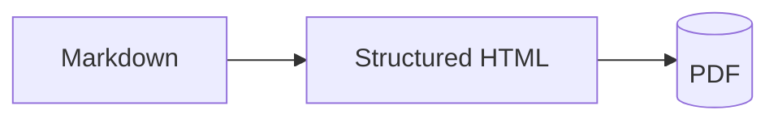

# Markdown Fidelity

Mardas MD2PDF treats Markdown as the source format for print-ready technical
publishing. The renderer intentionally supports a focused set of GitHub-,
MkDocs-, Pandoc-, Quarto-, and Obsidian-style conventions that commonly appear
in engineering reports, course notes, documentation, and mixed Persian/English
PDFs.

## Fenced code blocks

Code fences may include a language, title, line-number controls, highlighted
lines, and a custom starting line number.

```markdown
```python title="renderer.py" {2,5-6} linenos
def convert(markdown: str) -> bytes:
    html = render_markdown(markdown)
    pdf = render_pdf(html)
    return pdf
```
```

The same information can be written in Pandoc/MkDocs-style attributes:

```markdown
```{.python .numberLines title=renderer.py hl_lines="2 5-6"}
```
```

Supported title keys include `title`, `filename`, `file`, `caption`, and `name`.
Supported line-number flags include `linenos`, `line-numbers`, `numbered`,
`numberLines`, and `.numberLines`. Supported highlight keys include `hl_lines`,
`highlight`, `line-highlight`, `lines`, and `emphasize-lines`.

Use `linenostart`, `start`, `startline`, `line-start`, or `first-line` when a
snippet should keep the original line number from a source file:

```markdown
```python title="module.py" linenos linenostart=42 {43}
def first():
    return 1
```
```

When all highlighted line values are greater than or equal to the custom start
line, the renderer treats them as source-file line numbers and maps them back to
the snippet rows internally.

## Language aliases

Common aliases are normalized before syntax highlighting:

| Alias | Normalized language |
| :--- | :--- |
| `py` | `python` |
| `js` | `javascript` |
| `ts` | `typescript` |
| `sh`, `shell`, `zsh` | `bash` |
| `md` | `markdown` |
| `mmd` | `mermaid` |
| `yml` | `yaml` |

Unknown languages fall back to plain text while keeping the requested language
label in the code caption.

## Mermaid diagrams

Mermaid `flowchart` / `graph` fences are rendered offline to SVG. This keeps PDF
rendering reproducible and avoids CDN or browser-network dependencies.

```markdown

```

The offline renderer supports practical flowchart directions, labelled edges,
solid/dotted/thick edges, and common node shapes such as rectangles, rounded
nodes, diamonds, circles, databases, subroutines, stadium nodes, hexagons, and
parallelograms. Mermaid surfaces, nodes, labels, and edge chips use the active
appearance palette and include dedicated dark-mode contrast variables so diagrams
stay readable across all style/palette combinations. Unsupported Mermaid control
lines are ignored conservatively so that the PDF remains readable instead of
failing hard.

## Callouts

Blockquote callouts follow GitHub/Obsidian syntax:

```markdown
> [!NOTE]
> A regular note.

> [!SUCCESS] Build passed
> The renderer supports callout aliases.

> [!QUESTION]- Why?
> Fold markers are preserved as metadata but PDF output stays expanded.
```

Supported kinds include `NOTE`, `INFO`, `TIP`, `IMPORTANT`, `WARNING`,
`CAUTION`, `SUCCESS`, `QUESTION`, `FAILURE`, `DANGER`, `BUG`, `EXAMPLE`,
`QUOTE`, and `ABSTRACT`, plus common aliases such as `TODO`, `HINT`, `CHECK`,
`FAQ`, `ERROR`, `CITE`, and `TLDR`.

PDF output is static, so folded callouts are rendered expanded. The fold marker
is still preserved as a CSS class for styling and tests.

## Page breaks, math, footnotes, and images

The renderer also supports:

- inline and display MathJax expressions;
- footnotes with Markdown content;
- task lists;
- safe HTML after sanitization;
- document-local images with blocked placeholders for unsafe paths;
- `---page---`, `<!-- pagebreak -->`, and `::: pagebreak :::` style page breaks;
- image-caption pairs converted into semantic figures when the pattern is clear.

The Studio Preview is intentionally lightweight, but it mirrors these constructs
closely enough for day-to-day editing. The final authority is always the HTML/PDF
pipeline used by `mrs-md2pdf`.
