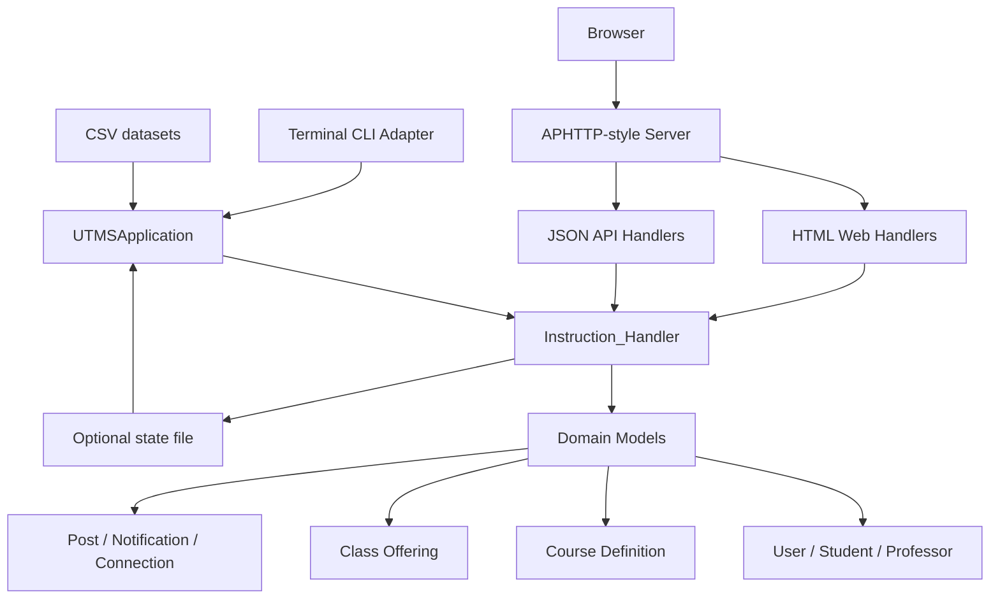
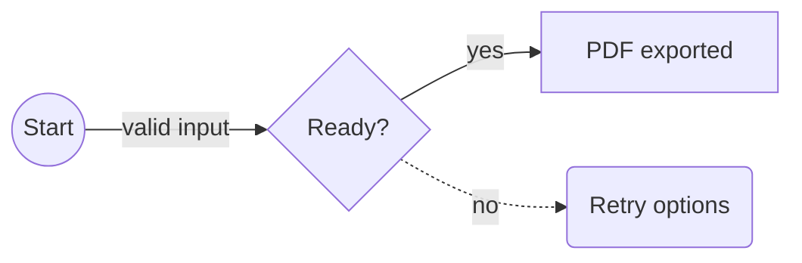
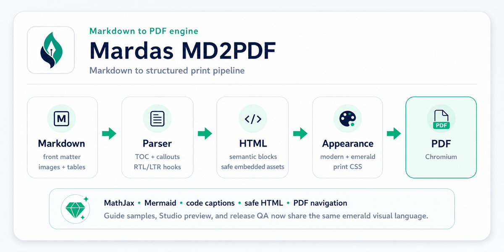
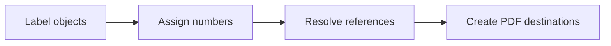

# Introduction

> [!NOTE]
> This guide is the complete user manual and feature reference for Mardas MD2PDF. It teaches each supported feature with runnable Markdown and keeps those same examples in the official PDF output.

Mardas MD2PDF is a Markdown-to-PDF publishing tool designed for documents that mix Persian and English content. It keeps the writing workflow simple while giving the final PDF a professional printed layout.

The project is useful for reports, university documents, technical guides, educational notes, research drafts, project documentation, and any Markdown file that needs a clean PDF output.

```text
Markdown -> Structured HTML -> Chromium PDF
```

The renderer does not draw paragraphs manually on a PDF canvas. Instead, it converts Markdown into a structured HTML document, applies print-oriented CSS, renders formulas with MathJax, and asks Chromium to produce the final PDF. This gives the project better support for CSS print layout, mixed text direction, SVG formulas, syntax-highlighted code, local images, and complex tables.

> [!NOTE]
> This guide is both documentation and a rendering sample. The PDF version of this file is available in the `examples/` directory, so users can inspect the actual output of every major feature.

> [!TIP]
> Mardas MD2PDF now keeps user-facing feature documentation in this guide instead of maintaining parallel feature-reference pages. Release, maintenance, security, and changelog files remain under `docs/` for project operations.

## Rendering sample checklist

The guide intentionally contains compact test cases for the renderer. When you review the generated PDF, check that these samples appear correctly:

Captioned images, tables, code listings, and Mermaid diagrams are now normalized as semantic print blocks so captions remain attached to their associated content in the generated PDF.

| Sample area | What to verify in the PDF |
| :--- | :--- |
| Cover and metadata | Title, subtitle, authors, summary, version, status, keywords, and language-specific labels. |
| TOC and outline | Nested heading numbers, internal links, and PDF viewer bookmarks generated from Markdown headings. |
| Mixed direction text | Persian/English text, inline code, and identifiers remain readable in the same paragraph. |
| MathJax | Inline math aligns with text and display equations are centered and scaled. |
| Code blocks | Fenced, indented, and language-less code blocks render without corrupting content. |
| Mermaid | A `flowchart` code fence becomes an SVG diagram instead of a plain code block. |
| Images and HTML | Local Markdown images and safe HTML image tags appear in the PDF. |
| Footnotes and page flow | Numeric footnote references, repeated-reference back-links, multiline footnotes, manual page breaks, margins, and footer numbering remain stable. |
| Persian/RTL audit | Persian punctuation, Latin/Persian numerals, RTL tables, mixed-script TOC headings, captions, and footnote backlinks remain readable. |

## Main capabilities

Mardas MD2PDF focuses on the features that matter most for polished technical PDFs:

| Capability | Description |
| :--- | :--- |
| Persian and English documents | `lang: fa`, `lang: en`, RTL/LTR shell direction, and mixed inline text. |
| Cover pages | Title, subtitle, authors, summary, logo, date, version, status, keywords, and academic metadata. |
| Table of contents and outline | Hierarchical TOC plus PDF viewer bookmarks generated from Markdown headings. |
| MathJax | Inline and display formulas with browser-rendered output. |
| Code blocks | Pygments syntax highlighting for fenced and indented code blocks. |
| Mermaid flowcharts | Offline SVG rendering for practical `flowchart` / `graph` diagrams. |
| Local images | Markdown and safe HTML images can be embedded as data URIs. |
| Safe HTML | Raw HTML is sanitized by default. |
| Footnotes | Multiline Markdown footnotes are supported. |
| Appearance system | Separate `style`, `palette`, and `mode` choices for layout shape, color, and light/dark output. |
| Automation | CLI workflow suitable for local scripts and CI jobs. |
| GUI | Local browser-based editor, preview, option selector, and exporter. |

# Installation

## Requirements

Before using the project, make sure you have:

- Python 3.10 or newer;
- a working virtual environment;
- Playwright Chromium installed;
- a Persian-capable font on the system, preferably Vazirmatn;
- Git, if you plan to clone the repository.

## Install from source

```bash
git clone https://github.com/mragetsars/Mardas-MD2PDF.git
cd Mardas-MD2PDF
python -m venv .venv
source .venv/bin/activate
pip install -e .
python -m playwright install chromium
```

On Windows PowerShell:

```powershell
python -m venv .venv
.venv\Scripts\Activate.ps1
pip install -e .
python -m playwright install chromium
```

## Development installation

For development, install the optional test dependencies:

```bash
pip install -e .[dev]
pytest
```

The package exposes two console commands:

| Command | Purpose |
| :--- | :--- |
| `mrs-md2pdf` | Convert Markdown files to PDF from the command line. |
| `mrs-md2pdf-gui` | Launch the local browser-based graphical interface. |

# First PDF

Create a simple PDF:

```bash
mrs-md2pdf input.md -o output.pdf
```

Create a PDF with a table of contents and the project's recommended Mardas appearance:

```bash
mrs-md2pdf input.md -o output.pdf --toc --style modern --palette emerald --mode light
```

Create a long report with book-like page flow:

```bash
mrs-md2pdf input.md -o output.pdf \
  --toc \
  --toc-depth 4 \
  --toc-page-break \
  --h1-page-break \
  --style textbook \
  --palette slate \
  --mode light
```

Save the intermediate HTML for debugging:

```bash
mrs-md2pdf input.md -o output.pdf --debug-html output.html
```

Show the progress bar explicitly in terminal sessions:

```bash
mrs-md2pdf input.md -o output.pdf --progress on
```

By default, `--progress auto` shows the progress bar only when the command is running in an interactive terminal. Use `--progress off` for quiet scripts.

# Recommended Workflow

A clean PDF workflow usually looks like this:

1. Write the content in Markdown.
2. Add YAML front matter for title, authors, language, direction, and cover metadata.
3. Render a first PDF with `--toc` and the desired appearance.
4. Review the cover, table of contents, math pages, code pages, image pages, and footer numbering.
5. If layout debugging is needed, export `--debug-html` and inspect the generated HTML in a browser.
6. Finalize the Markdown and render again.

For important documents, always review the final PDF visually. Automated tests can catch many problems, but typography, spacing, and page breaks still need human review.

PDF print-flow rules keep headings with following content, protect paragraphs from orphan/widow lines, and allow long code blocks or large tables to continue on the next page when keeping them together would waste space.

# Front Matter

Front matter is optional YAML placed at the beginning of the Markdown file. It controls the cover page, PDF metadata, document language, document direction, and several report-specific fields.

```yaml
---
title: "My Technical Report"
subtitle: "A Markdown-powered PDF document"
authors:
  - name: "Mardas"
    email: "mragetsars@gmail.com"
    affiliation: "Mardas Lab"
    role: "Author"
summary: |
  This text appears on the cover.
  Multiline summaries are supported.
institution: "University or Organization"
department: "Department name"
course: "Course or project title"
supervisor: "Supervisor name"
date: "2026-05-20"
version: "1.18.0"
status: "Draft"
keywords: [Markdown, PDF, RTL, MathJax]
cover_label: "Technical Report"
branding:
  mode: full
brand:
  name: "Acme Research Lab"
  logo: "assets/acme-logo.svg"
  footer: "Internal Technical Report"
lang: en
dir: ltr
---
```

## Common fields

| Field | Purpose |
| :--- | :--- |
| `title` | Cover title and PDF metadata title. |
| `subtitle` | Optional text under the main title. |
| `author` | Simple single-author value. |
| `authors` | List of author objects with optional `name`, `email`, `affiliation`, and `role`. |
| `summary` / `description` | Cover summary and PDF metadata subject. |
| `institution`, `department`, `course` | Academic or organizational context. |
| `supervisor`, `group`, `student_id` | Optional report metadata fields. |
| `date`, `version`, `status` | Cover cards used for document state. |
| `keywords` / `tags` | Cover keywords and PDF metadata keywords. |
| `cover_label` | Small label above the cover title. |
| `branding.mode` | Cover branding mode: `off`, `subtle`, or `full`. Default is `off`. |
| `brand.name`, `brand.logo`, `brand.footer` | Optional organization branding shown when branding is enabled. |
| `cover_logo` / `logo` | Legacy/custom logo path relative to the Markdown file. The file must be a supported regular image inside the document root. Prefer `brand.logo` for new documents. |
| `lang` | Built-in UI language, usually `en` or `fa`. |
| `dir` | Document shell direction: `auto`, `ltr`, or `rtl`. |

## Cover behavior

The cover is rendered separately from the main document. This gives the output cleaner page numbering and better watermark behavior:

- the cover is not counted as a content page;
- footer page numbering starts after the cover;
- watermarks are applied to content pages only;
- the cover may use full-page style backgrounds;
- the cover can be disabled when a plain document is needed.

Disable the cover:

```bash
mrs-md2pdf input.md -o output.pdf --no-cover
```

The default cover is unbranded. Enable full project or organization branding only when needed:

```bash
mrs-md2pdf input.md -o output.pdf --branding full --brand-name "Acme Research Lab"
```

Use a custom brand logo:

```bash
mrs-md2pdf input.md -o output.pdf --branding full --brand-logo ./assets/logo.png
```

Keep the cover but hide the logo:

```bash
mrs-md2pdf input.md -o output.pdf --no-cover-logo
```

Use `branding.mode: subtle` for a small generated-with note, and keep `branding.mode: full` for documents that intentionally show a product or organization brand. The guides in `examples/` use full branding because they document Mardas MD2PDF itself.

# Language and Direction

Direction is one of the most important parts of Persian/English PDF generation. Mardas MD2PDF separates language selection from direction control.

`lang: en` creates an English/LTR document shell, English cover labels, English callout titles, and a `Table of Contents` heading.

`lang: fa` creates a Persian/RTL document shell, Persian cover labels, Persian callout titles, and a `فهرست مطالب` heading.

## Direction priority

The document direction is resolved in this order:

1. CLI `--dir rtl|ltr|auto`
2. front matter fields such as `dir`, `direction`, `text_direction`, or `document_direction`
3. language-derived default from `lang`
4. automatic detection from the Markdown body

## Mixed text examples

English writing can include Persian terms such as راست به چپ, فونت فارسی, and گزارش فنی without breaking the surrounding sentence.

Persian writing can include English identifiers such as `Playwright`, `MathJax`, `GitHub Actions`, `PDF`, and `RTL/LTR` inside the same paragraph.

Inline code remains stable: `mrs-md2pdf input.md -o output.pdf --toc`.

## Persian/RTL visual smoke sample

This compact sample is intentionally part of the guide because the guide is both user documentation and a live renderer test case.[^rtl-smoke] It keeps Persian punctuation, Latin package names, Persian digits, semantic table captions, and mixed-direction cells in the official PDF examples.

آیا خروجی PDF برای `version 1.18.0` و شماره ۱۴۰۵ پایدار است؟ پاسخ: بله؛ جدول زیر باید RTL، mixed-script، و mixed-number hooks را فعال کند.

| بخش نمونه | مقدار | انتظار در PDF |
| :--- | :--- | :--- |
| شماره فارسی | ۱۴۰۵ | عدد فارسی با متن RTL پایدار بماند. |
| نسخه فنی | version 1.18.0 و ۱.۹.۹ | Latin/Persian numerals در یک سلول خوانا بمانند. |
| شناسه انگلیسی | `PDF`, `TOC`, `MathJax` | identifierهای English داخل جدول فارسی جابه‌جا نشوند. |

جدول ۱۲. نمونه جدول فارسی/RTL با عددهای ترکیبی.

Use this section as the Persian/RTL checklist for mixed identifiers, numeric styles, RTL tables, captions, and footnote back-links. The Persian guide repeats the same concepts in an RTL document shell.

# Table of Contents

Enable the table of contents:

```bash
mrs-md2pdf input.md -o output.pdf --toc
```

Control the depth:

```bash
mrs-md2pdf input.md -o output.pdf --toc --toc-depth 3
```

Start the body on a new page after the TOC:

```bash
mrs-md2pdf input.md -o output.pdf --toc --toc-page-break
```

Start each top-level heading on a new page:

```bash
mrs-md2pdf input.md -o output.pdf --h1-page-break
```

The TOC is generated from Markdown headings and preserves readable inline math in headings such as $E = mc^2$ and $\epsilon$.

Visible TOC links and PDF viewer bookmarks use the same preserved heading destinations, so clicking either navigation layer jumps to the actual content heading rather than to a matching row inside the table of contents.

# Markdown Feature Reference

## Paragraphs and emphasis

Markdown paragraphs, **bold text**, *italic text*, `inline code`, links, ordered lists, unordered lists, task lists, and blockquotes are supported.

## Lists

- Write content in Markdown.
- Add front matter for metadata.
- Render with the desired appearance.
- Review the final PDF.

1. Install the package.
2. Install Chromium.
3. Run the CLI.
4. Inspect the output.

## Task lists

- [x] Markdown input
- [x] Persian/English typography
- [x] MathJax rendering
- [x] Code highlighting
- [ ] Final human review

## Tables

| Feature | Status | Notes |
| :--- | :---: | :--- |
| Mixed RTL/LTR text | Yes | Paragraphs, headings, lists, and table cells receive direction-aware styling. |
| Local images | Yes | Markdown and safe HTML images are embedded when possible. |
| MathJax | Yes | Inline and display math use separate sizing rules. |
| Code highlighting | Yes | Pygments is used for fenced and indented code blocks. |
| Mermaid diagrams | Yes | Practical `flowchart` and `graph` fences are rendered as inline SVG diagrams. |
| Footnotes | Yes | Multiline Markdown footnotes are supported. |
| Raw HTML sanitizer | Yes | Unsafe tags and event handlers are removed by default. |

## Blockquotes

> Good PDF publishing is more than text conversion. Typography, line height, contrast, page flow, images, formulas, and predictable rendering all matter.

## Callouts

Callouts use GitHub-style markers and are translated according to the document language.

> [!NOTE]
> Use callouts for explanatory notes that should stand out visually.

> [!TIP]
> Use `--debug-html output.html` when you need to inspect the exact HTML sent to Chromium.

> [!WARNING]
> Use `--unsafe-html` only for trusted local Markdown because it disables the built-in sanitizer.

# GitHub-style Markdown Compatibility

Version 1.6.2 replaces the older parallel visual controls with one appearance model: `style` controls shape and layout, `palette` controls accent colors, and `mode` controls light or dark output. Use the GitHub style when the source document is similar to a README, project guide, API note, or engineering document:

```bash
mrs-md2pdf README.md -o README.pdf --style github --palette blue --mode light --toc
```

## Alerts

GitHub-style alerts are written as blockquotes and become highlighted PDF callouts:

> [!NOTE]
> Notes are useful for neutral explanations.

> [!IMPORTANT]
> Important blocks should contain information the reader should not miss.

> [!CAUTION]
> Caution blocks are intended for destructive or risky actions.

## Autolinks

Bare URLs and email addresses are linked automatically outside code spans:

- Project page: www.example.com/mardas-md2pdf
- Maintainer contact: docs@example.com
- Literal code remains unchanged: `www.example.com`

## Details and summary

HTML disclosure blocks are opened and styled for PDF output because a printed document cannot be interactive:

<details>
<summary>Advanced conversion notes</summary>
<p>This content is visible in the PDF and receives a printable disclosure-block style.</p>
</details>

## Heading anchors

Every heading receives a stable ID and a small permalink anchor. This improves internal links in the generated HTML and makes the PDF more navigable when links are preserved by the viewer.

## Manual page breaks

For reports that need controlled pagination, use any of these forms:

```md
<!-- pagebreak -->
```

```md
:::pagebreak
::: 
```

```md
---page---
```

The renderer normalizes them into the same PDF page-break element.

# MathJax

Inline math should match the surrounding line height: $E = mc^2$, $T = 500$, and $\Sigma = I \cdot \epsilon$ should sit naturally inside a paragraph.

Display math receives more visual space:

$$
\int_{-\infty}^{\infty} e^{-x^2}\,dx = \sqrt{\pi}
$$

A matrix example:

$$
A = \begin{bmatrix}
1 & 2 \\
3 & 4
\end{bmatrix}, \qquad \det(A) = -2
$$

An aligned equation block:

$$
\begin{aligned}
\text{precision} &= \frac{TP}{TP + FP} \\
\text{recall} &= \frac{TP}{TP + FN}
\end{aligned}
$$

## Math troubleshooting

If math appears as raw TeX:

- make sure `--no-mathjax` was not used;
- check the terminal for MathJax warnings;
- increase the browser timeout for very large math-heavy documents;
- render a smaller test file to isolate the problematic formula.

# Code Blocks

Fenced code blocks support syntax highlighting and language labels.

```python
from dataclasses import dataclass

@dataclass
class Document:
    title: str
    lang: str = "en"


def render_message(doc: Document) -> str:
    return f"Rendering {doc.title} as PDF"

print(render_message(Document("Mardas Guide")))
```

```javascript
const items = ["Markdown", "Persian", "English", "MathJax", "PDF"];
const message = items.map((item, index) => `${index + 1}. ${item}`).join("\n");
console.log(message);
```

Code fences without a language are also valid:

```
This block has no explicit language.
It should still render safely.
```

Indented code blocks are supported:

    SELECT title, lang, version
    FROM documents
    WHERE renderer = 'mardas-md2pdf';

Inline code is protected from math and footnote processing. For example, `$x$` and `[^note]` remain literal when they are inside backticks.

## Enhanced code fences

Code fences can carry a filename/title, line numbers, and highlighted lines. This is useful when the PDF should act as a teaching or review artifact.

````md
```python title="renderer.py" {2,5-6} linenos
def convert(markdown: str) -> bytes:
    html = render_markdown(markdown)
    pdf = render_pdf(html)
    metadata = inspect_pdf(pdf)
    log_export(metadata)
    return pdf
```
````

The `{2,5-6}` part means: highlight line 2 and the inclusive line range 5 through 6. Highlight numbers refer to rows inside the shown snippet, unless `linenostart` is used for source-file numbering.

The example above renders as a code block with a custom caption, line-number table, and highlighted lines:

```python title="renderer.py" {2,5-6} linenos
def convert(markdown: str) -> bytes:
    html = render_markdown(markdown)
    pdf = render_pdf(html)
    metadata = inspect_pdf(pdf)
    log_export(metadata)
    return pdf
```

# Mermaid Flowcharts

Mermaid-style flowchart fences are rendered as SVG diagrams during HTML post-processing. The renderer currently focuses on the common project-documentation subset: `flowchart` / `graph`, `TD`, `TB`, `BT`, `LR`, `RL`, rectangle nodes, rounded nodes, circles, diamonds, solid edges, dotted edges, thick edges, and labelled arrows.

The important point for the final PDF is that the following block should appear as a diagram, not as source code:



A smaller labelled-edge sample is useful when checking edge labels and node shapes:



If a Mermaid block uses advanced syntax outside the supported subset, keep a small fallback screenshot or image in the Markdown until that syntax is added to the renderer. For ordinary architecture and data-flow diagrams, the built-in renderer is enough and does not need internet access.

# Images and Safe HTML

Markdown images are embedded when they point to local files. A common caption pattern is also promoted to a real PDF figure:

```md


*Figure 1. Architecture overview.*
```

When the caption starts with `Figure`, `Fig.`, `شکل`, or `تصویر`, the renderer wraps the image and caption in a semantic figure block. Safe HTML image attributes such as `width` and `height` are preserved:

```html

```


Images are resolved relative to the Markdown file. Local images are embedded into the generated HTML/PDF when they are small enough to embed safely.


*Figure 1. Architecture overview.*

Safe raw HTML images can also be used when explicit sizing is needed. The guide deliberately reuses the same banner/architecture asset here so the HTML example exercises width handling without switching to an unrelated raw logo:


## Image rules

- Prefer local images for stable PDF output.
- Keep images reasonably sized before embedding them.
- Use paths relative to the Markdown file.
- Keep image paths inside the Markdown document directory. Absolute paths, `file:` URLs, parent-directory escapes such as `../secret.png`, and current-working-directory fallbacks are blocked by default.
- If an image cannot be embedded safely, it is replaced with a visible blocked placeholder so Chromium does not load it through the document `<base>` URL.
- Remote `http(s)` images are blocked by default for privacy and reproducibility. Use `--allow-remote-assets` only for trusted documents that intentionally fetch network images.
- In the GUI, attach local image files or image folders before exporting.
- Very large images are blocked and a warning is printed to avoid excessive memory usage.

## Safe HTML

Raw HTML is sanitized by default. The sanitizer keeps document-oriented elements such as `<div>`, `<span>`, `<table>`, `<figure>`, and ``, while removing active or unsafe content such as scripts, event handlers, iframes, forms, remote stylesheets, `file:` URLs, unsafe URL schemes, and non-raster `data:` image URLs.

Safe `data:` images are limited to common raster formats such as PNG, JPEG, GIF, WebP, BMP, and AVIF. Inline SVG data URLs are blocked in safe HTML; use a local SVG/PNG file you trust or a Mermaid block for diagrams.

Use unsafe HTML only for trusted local files:

```bash
mrs-md2pdf input.md -o output.pdf --unsafe-html
```

<div class="md2pdf-page-break"></div>


# Security and Trusted Inputs

Mardas MD2PDF is a local publishing tool. Treat Markdown, GUI attachments, cover logos, watermarks, and raw HTML as trusted author content unless you run the converter inside an isolated environment.

Default rendering keeps a conservative file boundary: local images are resolved relative to the Markdown file, embedded as `data:` URLs when safe, and blocked with a visible placeholder when they point outside the document directory or cannot be embedded. Remote `http(s)` images are also blocked by default and require `--allow-remote-assets`. Raw HTML is sanitized unless `--unsafe-html` is used.

Chromium sandboxing is controlled by `--chromium-sandbox`:

| Mode | Behavior |
| :--- | :--- |
| `auto` | Keep sandboxing on for normal users; disable only when running as root. |
| `on` | Always request Chromium sandboxing. |
| `off` | Pass `--no-sandbox`; use only in trusted containers or isolated CI jobs. |

For untrusted documents, render in a container or disposable environment and keep `--unsafe-html` off. See `../SECURITY.md` for the full policy.

## PDF navigation and metadata

Rendered PDFs include standard document metadata from front matter and a viewer outline generated from Markdown headings. The printed table of contents remains visible in the document body, while the PDF outline gives readers a sidebar-friendly way to jump between sections in compatible PDF viewers.

Use `--toc` when you also want a printed table of contents. The PDF outline is generated from the same heading collection so both navigation surfaces stay in sync.

## Input and output integrity

Malformed, recursive, excessively deep, or oversized YAML front matter is rejected with a controlled diagnostic. UTF-8 files with a BOM are accepted. The CLI also refuses to use the same underlying file for Markdown input, PDF output, or debug HTML, and commits successful PDF/debug output atomically so an interrupted write preserves the previous artifact.

Relative links to local filesystem targets remain readable in the document but are not exported as machine-specific `file:` links. Manual and generated heading identifiers are deduplicated so TOC and PDF destinations remain unambiguous.

# Page Flow and Layout

## Manual page breaks

A manual page break can be inserted with safe HTML:

```html
<div class="md2pdf-page-break"></div>
```

## Page size

Use a named page size:

```bash
mrs-md2pdf input.md -o output.pdf --page-size A4
```

Use landscape orientation:

```bash
mrs-md2pdf input.md -o output.pdf --page-size "A4 landscape"
```

Use explicit dimensions:

```bash
mrs-md2pdf input.md -o output.pdf --page-size "210mm 297mm"
```

Named A0-A6, B0-B6, Letter, Legal, Tabloid, and Ledger sizes are converted to explicit Chromium dimensions so unsupported named formats do not silently fall back to A4. Custom dimensions must remain between 10 mm and 5000 mm per side. Unknown or out-of-range values fail early, and Studio uses the same validation with a structured `invalid_page_size` error.

## Margins

```bash
mrs-md2pdf input.md -o output.pdf \
  --margin-top 18mm \
  --margin-bottom 18mm \
  --margin-x 16mm
```

# Watermarks

Text watermark:

```bash
mrs-md2pdf input.md -o output.pdf --watermark "DRAFT"
```

Image watermark:

```bash
mrs-md2pdf input.md -o output.pdf \
  --watermark-image ./src/mardas_md2pdf/assets/mardas-md2pdf-logo.png \
  --watermark-opacity 0.05 \
  --watermark-width 95mm
```

Watermarks are applied to content pages only, not to the cover page.

# Cover Branding

Generated PDFs are unbranded by default. This avoids turning ordinary reports into product advertisements and keeps the cover focused on the document owner.

```yaml
branding:
  mode: off
```

Available modes:

| Mode | Use case |
| :--- | :--- |
| `off` | Default for ordinary reports and handouts. |
| `subtle` | Small generated-with note for informal shared drafts. |
| `full` | Intentional project or organization branding. |

Custom organization branding:

```yaml
branding:
  mode: full
brand:
  name: "Acme Research Lab"
  logo: "assets/acme.png"
  footer: "Internal Technical Report"
```

CLI equivalent:

```bash
mrs-md2pdf input.md -o output.pdf \
  --branding full \
  --brand-name "Acme Research Lab" \
  --brand-logo assets/acme.png \
  --brand-footer "Internal Technical Report"
```

The English and Persian guides explicitly use `branding.mode: full` because they are project examples.


# Appearance

Mardas MD2PDF uses one appearance system instead of parallel visual presets. Choose a `style` for document shape, a `palette` for accent colors, and a `mode` for light or dark output.

| Style | Best for |
| :--- | :--- |
| `modern` | General documentation, proposals, software reports, and product-style guides. |
| `github` | README-like project documentation and GitHub-style Markdown output. |
| `textbook` | Long educational documents, course notes, Persian/English learning material. |
| `academic` | Formal reports, university documents, thesis-like drafts, and structured papers. |

| Palette | Accent feel |
| :--- | :--- |
| `blue` | Default professional blue. |
| `emerald` | Calm green. |
| `violet` | Creative purple. |
| `amber` | Warm teaching/review accent. |
| `rose` | Editorial red-pink accent. |
| `slate` | Cool understated neutral. |
| `neutral` | Minimal grayscale. |

Choose appearance from the CLI:

```bash
mrs-md2pdf input.md -o output.pdf --style modern --palette emerald --mode light
mrs-md2pdf input.md -o output.pdf --style academic --palette emerald --mode dark
```

Or store it in front matter:

```yaml
appearance:
  style: modern
  palette: emerald
  mode: light
```

Discover choices with `--list-styles`, `--list-palettes`, and `--list-modes`.

Dark mode is style-aware. `modern` uses a deep navy surface, `github` follows a GitHub-like dark surface, `textbook` keeps the nearly black screen/cover look, and `academic` uses a warm charcoal surface. Palettes still control accent colors in both light and dark modes, including cover decorations and callouts.

# Project Configuration and Diagnostics

Use a versioned `mardas.toml` when a document or repository needs repeatable settings without a long command line. Create the initial file in the current directory:

```bash
mrs-md2pdf init
```

The generated configuration is deliberately conservative: safe HTML, blocked remote assets, an ordinary A4 page, explicit appearance settings, and schema version `1`. Relative paths in the configuration are resolved from the directory containing `mardas.toml`, not from the shell working directory.

A compact project configuration can look like this:

```toml
schema_version = 1

[project]
title = "Numerical Methods Report"
author = "Research Team"
direction = "auto"

[output]
page_size = "A4"
toc = true
toc_depth = 3
toc_page_break = true
cover = true
header_footer = true
mathjax = true
margin_top = "18mm"
margin_bottom = "20mm"
margin_x = "16mm"

[appearance]
style = "academic"
palette = "emerald"
mode = "light"

[branding]
mode = "off"
# logo = "assets/lab-logo.png"

[security]
unsafe_html = false
allow_remote_assets = false

[browser]
chromium_sandbox = "auto"
timeout_ms = 120000
```

The CLI discovers the nearest `mardas.toml` by starting beside the Markdown file and walking toward the filesystem root. Use `--config path/to/mardas.toml` for an explicit file or `--no-config` to disable discovery. Precedence is deterministic:

```text
explicit CLI option > mardas.toml > equivalent front matter > built-in default
```

Negative overrides such as `--no-toc`, `--cover`, `--header-footer`, `--mathjax`, `--safe-html`, and `--block-remote-assets` make it possible to override enabled or disabled project settings from automation scripts.

Validate configuration and Markdown without launching Chromium:

```bash
mrs-md2pdf validate report.md
mrs-md2pdf validate report.md --format json
```

Validation reports malformed TOML or YAML, unsupported schema versions, unknown keys, invalid values, missing configured assets, blocked images, heading-level jumps, and risky security settings. Diagnostics use stable identifiers such as `MARDAS-E103`, `MARDAS-E109`, `MARDAS-W203`, and `MARDAS-W301`; automation should rely on the code rather than matching the English message.

Inspect the effective values and their sources:

```bash
mrs-md2pdf explain-config report.md
mrs-md2pdf explain-config report.md --format json
```

Check the local runtime, packaged MathJax, required dependencies, Chromium discovery, configuration, and optionally the document itself:

```bash
mrs-md2pdf doctor
mrs-md2pdf doctor report.md --format json
```

Warnings do not make `validate` or `doctor` fail, while error diagnostics return a non-zero exit status. A configuration that enables `unsafe_html` or remote assets is accepted only as an explicit project decision and is surfaced as a warning because it expands the trust boundary and can reduce build reproducibility.

# Multi-file Book Mode

Book Mode builds one PDF from an explicit, deterministic list of Markdown chapters. It is intended for books, theses, long reports, course notes, and documentation sets whose source should remain split into manageable files.

Create a starter project:

```bash
mrs-md2pdf init my-book --book
```

The generated project contains `mardas.toml` and two starter chapter files:

```text
my-book/
├── mardas.toml
└── chapters/
    ├── 01-introduction.md
    └── 02-content.md
```

A Book Mode manifest uses an ordered `[book].chapters` array. The array order, not directory sorting, controls the PDF order:

```toml
schema_version = 1

[project]
title = "Numerical Methods Handbook"
author = "Research Group"
direction = "ltr"

[output]
toc = true
toc_depth = 4
cover = true
header_footer = true
mathjax = true

[book]
chapters = [
  "chapters/01-introduction.md",
  { path = "chapters/02-methods.md", title = "Methods and Experiments" },
  "chapters/03-results.md",
]
output = "dist/handbook.pdf"
chapter_page_break = true
```

The optional chapter `title` replaces the visible level-one heading and global TOC title for that chapter without modifying the Markdown source. If a chapter has no level-one heading, Book Mode generates one from the chapter title and reports `MARDAS-W501`.

Validate and inspect the complete project without launching Chromium:

```bash
mrs-md2pdf validate-book my-book
mrs-md2pdf validate-book my-book --format json
mrs-md2pdf explain-book my-book --format json
```

Build the PDF and optionally keep the combined renderer HTML:

```bash
mrs-md2pdf build-book my-book
mrs-md2pdf build-book my-book -o releases/handbook.pdf
mrs-md2pdf build-book my-book --debug-html build/handbook.html --progress on
```

Book Mode applies these rules:

1. Every chapter path must be relative to `mardas.toml`, remain inside the project root after symlink resolution, use a supported Markdown extension, and appear only once.
2. Project settings provide the shared cover, output, appearance, security, browser, font, watermark, and PDF configuration. Chapter front matter still controls chapter-local language and content metadata where applicable.
3. Images may be stored beside a chapter or in a shared directory inside the project root, such as `assets/`. Files outside the project root remain blocked.
4. Heading, anchor, and footnote IDs are namespaced per chapter before assembly, so repeated headings such as `# Introduction` remain unambiguous.
5. Relative Markdown links to another listed chapter are converted to internal PDF links. A fragment such as `02-methods.md#model` resolves to the namespaced heading in that chapter. Other local file links remain inert for portable PDF output.
6. A page break is inserted between chapters when `chapter_page_break = true`.
7. The final PDF contains one cover, one global TOC, one nested PDF outline, one metadata set, stable named destinations, and one output artifact.

Book Mode shares the same reference symbol table across all listed chapters. With `numbering_scope = "chapter"`, an object in chapter 2 receives a number such as `2.1`; with `global`, numbering remains continuous across the complete book. Bibliography processing remains a separate phase.

# Cross-references and Numbering

Cross-references are opt-in. Enable them in `mardas.toml` or front matter:

```toml
[references]
enabled = true
numbering_scope = "global"
list_of_figures = true
list_of_tables = true
list_of_equations = true
list_of_listings = true
```

The same fields may be written under a front-matter `references:` mapping. Command-line automation can override them with `--references`, `--no-references`, `--numbering-scope global|chapter`, and paired `--list-of-*` / `--no-list-of-*` options.

Supported semantic object kinds are:

| Prefix | Object | Label placement |
| :--- | :--- | :--- |
| `fig` | Markdown images and Mermaid figures | In the caption or as a standalone marker immediately after the object. |
| `tbl` | Markdown tables | At the end of the `Table:` caption. |
| `eq` | Display MathJax equations | As a standalone marker immediately after the equation. |
| `lst` | Fenced code listings | In the opening fence metadata. |

Table: Supported semantic reference objects {#tbl:guide-reference-kinds}

Use a semantic label and refer to it with the matching `@kind:name` token:

````markdown
See @fig:processing-flow, @tbl:metrics, @eq:energy, and @lst:training-loop.


*Figure. Processing architecture.* {#fig:processing-flow}

| Metric | Value |
| :--- | ---: |
| Accuracy | 0.98 |

Table: Evaluation metrics {#tbl:metrics}

$$
E = mc^2
$$

{#eq:energy}

```python title="Training loop" {#lst:training-loop}
print("train")
```
````

The next examples are live renderer checks in this guide. The references @fig:guide-reference-flow, @tbl:guide-reference-kinds, @eq:guide-reference-energy, and @lst:guide-reference-code must become internal PDF links with stable localized numbers.



$$
E = mc^2
$$

{#eq:guide-reference-energy}

```python title="Reference validation" {#lst:guide-reference-code}
labels = {"fig:flow", "tbl:metrics"}
assert len(labels) == 2
```

Labels must be unique across the complete output. Book Mode resolves references only after all chapters are assembled, so a reference in one chapter can target a labeled object in another. Duplicate labels, unresolved references, kind mismatches, malformed labels, and unattached label markers produce stable `MARDAS-E60x` / `MARDAS-W603` diagnostics before Chromium starts. References inside code, existing links, scripts, styles, and other literal contexts remain untouched.

Generated reference lists are placed after the table of contents and before the document body. Only explicitly labeled objects are included. This guide enables all four lists as a live release sample.

# Bibliography and Citations

The citation engine is offline-first and opt-in. It reads local BibTeX (`.bib`) or CSL JSON (`.json`) files and never performs DOI lookup or network metadata retrieval during a build.

Enable it in `mardas.toml`:

```toml
[bibliography]
enabled = true
sources = ["references.bib"]
style = "author-date"
include_uncited = false
# title = "References"
```

The same source may be declared in front matter:

```yaml
bibliography: references.bib
citations:
  enabled: true
  style: author-date
  include_uncited: false
```

Supported citation forms are deliberately small and deterministic:

```markdown
Prior work supports this result [@doe2024].
Several studies agree [@doe2024, p. 12; @smith2023].
Narrative citation: @doe2024 describes the method.
```

Use `style = "numeric"` for first-use numbering such as `[1]`; `author-date` generates localized author/year citations and deterministic `a`, `b`, ... suffixes when the same author has multiple works in one year. Bibliography entries are linked to their first citation and citation links target stable `#bib-*` destinations. Book Mode loads project bibliography sources once and resolves all chapter citations only after chapter assembly, so one bibliography is generated for the complete book.

The next sentence is a live renderer check. It must produce two disambiguated grouped citations [@mardas2026a, p. 14; @mardas2026b] and one narrative citation to @ahmadi1404, followed by one generated bibliography at the end of this guide.

Validation rejects missing sources, invalid BibTeX/CSL JSON, duplicate keys, undefined citation keys, malformed citation groups, repeated source files, oversized sources, and excessive entry counts with stable `MARDAS-E70x` diagnostics before Chromium starts. Citation-like text inside code, existing links, scripts, styles, and other literal contexts remains unchanged.

# GUI Workflow

Launch the GUI for a standalone document:

```bash
mrs-md2pdf-gui
```

Open a live project workspace rooted at `mardas.toml`:

```bash
mrs-md2pdf-gui --project path/to/project
```

Project Workspace mode shows the ordered Book Mode chapters and supported project text files in a Project Explorer. The Problems panel uses the same `MARDAS-*` diagnostics as `validate` and `validate-book`; selecting a problem opens the responsible file and moves the editor to its line and column when available. The active Markdown file uses renderer-backed project configuration, bibliography, cross-references, and project-root asset rules. **Preview Book** and **Export Book** operate on the saved complete project, so save the active file before running either action.

Project files are edited in place only after an explicit `--project` launch. Studio accepts supported UTF-8 text files inside the project root, rejects hidden/generated paths and symbolic links, limits each editable file to 4 MiB, and uses the previously opened SHA-256 value to reject an external-change conflict. Successful saves use atomic replacement and preserve the existing file mode. The legacy **Open Bundle** and **Save Bundle** controls remain available for portable `.mardas.json` snapshots; a bundle is not the same as a live project workspace.

The GUI is useful for users who prefer a visual workflow:

1. Paste or type Markdown.
2. Fill the **Document** section for title, author, output filename, page size, and direction.
3. Choose **Appearance** cards for style, palette, and light/dark mode.
4. Choose **Branding** only when the PDF should show a product, organization, or lab mark.
5. Use **Layout** for TOC, cover, and page-flow choices.
6. Open **Advanced** only when you need watermarks, hidden page numbers, or attached local assets.
7. Use the default PDF-like preview for renderer-backed HTML with page size, margins, and auto-fit scaling; switch to Fast preview only when you need instant browser-local feedback and can accept approximate Markdown parsing. Fast Preview does not fetch remote/local image paths and disables unsafe or filesystem link schemes.
8. Use **Ctrl/Cmd+S** to save Markdown or the active Project Workspace file, **Ctrl/Cmd+Shift+S** to save a portable `.mardas.json` bundle, and **Ctrl/Cmd+Enter** to export quickly.

Studio stores the current draft, layout, interface mode, direction toggle, editor width, and export settings in browser local storage. This makes accidental refreshes less disruptive during long editing sessions. Use **Reset State** when you want to clear the saved local draft and return to a clean workspace. This section is the Studio workflow reference for users.

If an export fails, Studio shows the HTTP status and stable backend error code, such as `invalid_json`, `invalid_page_size`, `invalid_toc_depth`, `invalid_watermark_opacity`, `markdown_too_large`, or `render_failed`. If you bind Studio to a non-local host, the backend prints a warning because other users on the reachable network can submit Markdown and attached assets.

> [!IMPORTANT]
> Studio defaults to an auto-scaling PDF-like renderer preview with page size and margins. Fast Preview remains useful for instant editing, but it is an approximate browser-local parser with a deliberately restricted URL policy; final fidelity, page breaks, attached assets, MathJax, Mermaid, and security validation are determined by the backend renderer and Chromium print layout during PDF export.

# CLI Reference

| Option | Description |
| :--- | :--- |
| `input` | Input Markdown file. |
| `-o`, `--output` | Output PDF path. |
| `--title`, `--author`, `--description` | Override metadata from front matter. |
| `--toc`, `--toc-depth` | Enable and configure the table of contents. |
| `--references`, `--no-references` | Enable or disable semantic object numbering and cross-references. |
| `--numbering-scope` | Use continuous `global` numbering or `chapter` numbering in Book Mode. |
| `--list-of-figures`, `--list-of-tables`, `--list-of-equations`, `--list-of-listings` | Generate selected reference lists; each option also has a paired `--no-list-of-*` override. |
| `--citations`, `--no-citations` | Enable or disable citation resolution and generated bibliography output. |
| `--bibliography PATH` | Add a local `.bib` or CSL `.json` source; repeat for multiple sources. |
| `--citation-style` | Select the built-in `author-date` or `numeric` style. |
| `--bibliography-title`, `--include-uncited`, `--cited-only` | Customize the bibliography heading and whether uncited entries are included. |
| `--toc-page-break`, `--h1-page-break` | Control printed page flow. |
| `--style` | Choose `modern`, `github`, `textbook`, or `academic`. |
| `--palette` | Choose `blue`, `emerald`, `violet`, `amber`, `rose`, `slate`, or `neutral`. |
| `--mode` | Choose `light` or `dark`. |
| `--list-styles`, `--list-palettes`, `--list-modes` | Print available appearance choices and exit. |
| `--page-size` | Use `A4`, `Letter`, `Legal`, `A4 landscape`, or dimensions such as `210mm 297mm`. |
| `--dir` | Force `auto`, `ltr`, or `rtl`. |
| `--margin-top`, `--margin-bottom`, `--margin-x` | Control page margins. |
| `--font-dir` | Directory containing local Vazirmatn font files. |
| `--chromium-path` | Custom Chromium or Chrome executable path. |
| `--chromium-sandbox` | Chromium sandbox mode: `auto`, `on`, or `off`. Default: `auto`. |
| `--debug-html` | Save the intermediate HTML. |
| `--no-cover`, `--branding`, `--brand-name`, `--brand-logo`, `--brand-footer`, `--no-cover-logo` | Configure the cover and explicit branding. |
| `--watermark`, `--watermark-image` | Add mode-aware text or image watermarks over content pages. |
| `--allow-remote-assets` | Allow trusted Markdown to fetch remote `http(s)` images. Disabled by default. |
| `--no-header-footer` | Disable printed footer. |
| `--no-mathjax` | Do not load MathJax. |
| `--unsafe-html` | Disable raw HTML sanitization for trusted files. |
| `--timeout-ms` | Browser timeout in milliseconds. |
| `--progress` | Terminal progress bar mode: `auto`, `on`, or `off`. Default: `auto`. |

Run the full help command when needed:

```bash
mrs-md2pdf --help
```

# Automation and CI

A typical automation command can be as simple as:

```bash
mrs-md2pdf docs/report.md -o build/report.pdf --toc --style modern --palette emerald --mode light
```

The repository includes a GitHub Actions CI workflow that runs Ruff, pytest, and a Chromium render smoke test on supported Python versions. For CI workflows, prefer explicit options:

```bash
mrs-md2pdf docs/report.md -o build/report.pdf \
  --toc \
  --toc-depth 4 \
  --style modern \
  --palette emerald \
  --mode light \
  --page-size A4 \
  --dir auto \
  --timeout-ms 60000 \
  --progress off
```

For debugging CI failures, save the intermediate HTML as an artifact:

```bash
mrs-md2pdf docs/report.md -o build/report.pdf --debug-html build/report.html
```

# Troubleshooting

## Chromium is missing

Run:

```bash
python -m playwright install chromium
```

or pass a custom browser path:

```bash
mrs-md2pdf input.md -o output.pdf --chromium-path /path/to/chrome
```

## Persian text looks wrong

Install a Persian-capable font such as Vazirmatn, or pass a font directory:

```bash
mrs-md2pdf input.md -o output.pdf --font-dir ./fonts
```

If the directory is missing or does not contain recognized font files, the renderer prints a fallback warning and uses system fonts.

## Images do not appear

Check that image paths are relative to the Markdown file and stay inside the Markdown document directory. Absolute paths, `file:` URLs, parent-directory escapes, missing files, remote images, and very large files are replaced with a visible blocked placeholder instead of being loaded by Chromium. If you use the GUI, attach the local images or folders before export and check renderer warnings.

## Math appears as raw TeX

Make sure MathJax is enabled and check for renderer warnings. For large documents, increase the timeout:

```bash
mrs-md2pdf input.md -o output.pdf --timeout-ms 90000
```

## Layout needs inspection

Export debug HTML:

```bash
mrs-md2pdf input.md -o output.pdf --debug-html output.html
```

Open `output.html` in a browser and inspect the generated structure and CSS.

# PDF Preflight Checks

For important public PDFs, run a quick preflight after building the examples. This check rasterizes representative pages, lists embedded fonts, and records PDF syntax warnings before a document is released:

```bash
python scripts/check_pdf_preflight.py \
  examples/GUIDE.en.pdf \
  examples/GUIDE.fa.pdf \
  --pages 1,2,3 \
  --output build/pdf-preflight.json
```

A clean visual result still matters more than a raw tool warning, but preflight output gives maintainers a repeatable place to catch font, rasterization, and PDF parser regressions.

# Footnotes

Footnotes are useful for references, technical notes, and extra explanations.[^footnote-demo]

[^rtl-smoke]: This live sample intentionally exercises Persian punctuation, mixed Latin identifiers, Persian digits, semantic table captions, and page-local footnote rendering in the official English guide.

[^footnote-demo]: Mardas MD2PDF intentionally uses Chromium for layout instead of drawing every paragraph directly on a PDF canvas.
    This gives the project strong support for CSS print rules, mixed direction text, MathJax SVG output, tables, local images, and syntax-highlighted code.

    - Page-local footnote blocks are inserted near the reference instead of being collected as document-end endnotes.
    - Multiline footnotes are supported.
    - Markdown inside footnotes is preserved.
    - Inline code like `@page`, `$x$`, and `[^id]` remains readable when it is written inside backticks.

# Final Publishing Checklist

Before publishing an important PDF, check the following items:

- [x] Cover title, subtitle, author, date, and metadata.
- [x] Language and document direction.
- [x] Table of contents depth and labels.
- [x] Pages containing formulas.
- [x] Pages containing code blocks and inline code.
- [x] Pages containing local images.
- [x] Tables that span wide content.
- [x] Footnotes and links.
- [x] Footer numbering after the cover.
- [ ] Final visual review in a PDF viewer.
- [ ] Release checklist completed when publishing a tagged version: `docs/RELEASE.md`.
