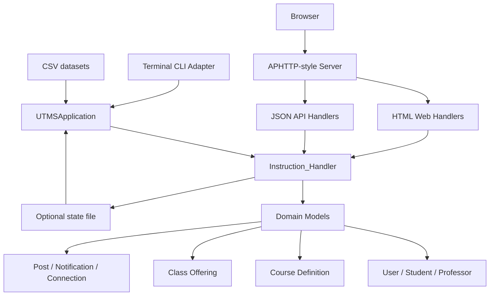
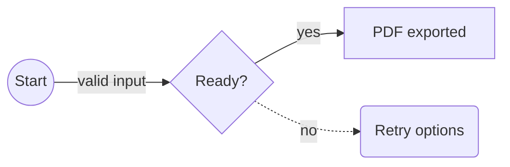

# معرفی

> [!NOTE]
> این راهنما مرجع کامل کاربر و مرجع امکانات Mardas MD2PDF است. هر قابلیت پشتیبانی‌شده با Markdown قابل اجرا آموزش داده می‌شود و همان نمونه‌ها در PDF رسمی هم دیده می‌شوند.

برنامه Mardas MD2PDF ابزاری برای تبدیل Markdown به PDF است که مخصوص سندهای فارسی، انگلیسی و ترکیبی طراحی شده است. هدف پروژه این است که نویسنده بتواند متن را در قالب ساده Markdown بنویسد، اما خروجی نهایی شبیه یک سند PDF مرتب، حرفه‌ای و قابل انتشار باشد.

این پروژه برای گزارش‌های دانشگاهی، مستندات فنی، جزوه‌های آموزشی، راهنماهای نرم‌افزاری، پیش‌نویس‌های پژوهشی، گزارش پروژه و هر سند Markdown که نیاز به خروجی PDF تمیز دارد مناسب است.

```text
Markdown -> Structured HTML -> Chromium PDF
```

در این پروژه متن‌ها مستقیماً روی canvas فایل PDF رسم نمی‌شوند. ابتدا Markdown به HTML ساختاریافته تبدیل می‌شود، سپس CSS چاپی و تنظیمات appearance اعمال می‌شود، فرمول‌ها با MathJax رندر می‌شوند و در مرحله آخر Chromium خروجی PDF را تولید می‌کند. این روش باعث پشتیبانی بهتر از layout چاپی، متن‌های ترکیبی RTL/LTR، فرمول‌های SVG، کدهای هایلایت‌شده، تصویرهای محلی و جدول‌های پیچیده می‌شود.

> [!NOTE]
> این راهنما هم مستند استفاده است و هم نمونه رندر. نسخه PDF همین فایل در پوشه `examples/` قرار دارد تا کاربر بتواند خروجی واقعی هر قابلیت مهم را بررسی کند.

> [!TIP]
> مستندات کاربر در همین guide نگه داشته می‌شود و صفحه‌های feature/reference موازی حذف شده‌اند تا متن آموزشی و نمونه‌های PDF از هم جدا و ناسازگار نشوند. فایل‌های release، maintenance، security و changelog فقط برای عملیات پروژه در پوشه `docs/` باقی مانده‌اند.

## چک‌لیست نمونه‌های رندر

این راهنما عمداً چند نمونه کوچک اما مهم دارد تا کنار راهنمای برنامه، مثل test case تصویری هم عمل کند. وقتی PDF خروجی را بررسی می‌کنید، این موارد را ببینید:

تصویرها، جدول‌ها، بلوک‌های کد و نمودارهای Mermaid دارای caption حالا به صورت بلوک‌های معنایی چاپی نرمال می‌شوند تا توضیح هر بخش در PDF کنار محتوای مربوط به خودش باقی بماند.

| بخش نمونه | چیزی که باید در PDF بررسی شود |
| :--- | :--- |
| جلد و metadata | عنوان، زیرعنوان، نویسنده‌ها، خلاصه، نسخه، وضعیت، کلیدواژه و labelهای وابسته به زبان. |
| فهرست مطالب و outline | شماره‌گذاری تودرتو، لینک‌های داخلی و bookmarkهای PDF viewer که از headingهای Markdown ساخته می‌شوند. |
| متن ترکیبی | متن فارسی/English، inline code و شناسه‌ها در یک پاراگراف خوانا بمانند. |
| فرمول MathJax | فرمول درون‌خطی با متن هماهنگ باشد و فرمول نمایشی وسط‌چین و خوش‌اندازه دیده شود. |
| بلوک کد | fenced، indented و code block بدون زبان بدون خراب شدن محتوا رندر شوند. |
| نمودار Mermaid | بلوک کد از نوع `flowchart` به جای نمایش کد خام، به نمودار SVG تبدیل شود. |
| تصویر و HTML | تصویر Markdown و تگ امن HTML در PDF دیده شوند. |
| پانویس و صفحه‌بندی | ارجاع عددی پانویس، لینک بازگشت برای ارجاع‌های تکراری، پانویس چندخطی، شکست صفحه دستی، marginها و شماره صفحه پایدار باشند. |
| audit فارسی/RTL | نشانه‌گذاری فارسی، عددهای فارسی/لاتین، جدول‌های RTL، عنوان‌های mixed-script در فهرست، captionها و back-link پانویس خوانا بمانند. |

## قابلیت‌های اصلی

| قابلیت | توضیح |
| :--- | :--- |
| سندهای فارسی و انگلیسی | پشتیبانی از `lang: fa`، `lang: en`، جهت RTL/LTR و متن ترکیبی. |
| جلد حرفه‌ای | عنوان، زیرعنوان، نویسنده‌ها، خلاصه، لوگو، تاریخ، نسخه، وضعیت، کلیدواژه و metadata آموزشی. |
| فهرست مطالب و outline | ساخت فهرست چندسطحی و bookmarkهای PDF viewer از headingهای Markdown. |
| فرمول MathJax | رندر فرمول‌های درون‌خطی و نمایشی. |
| بلوک کد | هایلایت کدهای fenced و indented با Pygments. |
| نمودار Mermaid | رندر آفلاین نمودارهای کاربردی `flowchart` / `graph` به صورت SVG. |
| تصویر محلی | جاسازی تصویرهای Markdown و HTML امن به صورت data URI. |
| کد HTML امن | پاک‌سازی HTML خام به صورت پیش‌فرض. |
| پانویس | پشتیبانی از پانویس‌های چندخطی با محتوای Markdown. |
| سیستم Appearance | انتخاب جداگانه `style`، `palette` و `mode` برای شکل سند، رنگ‌بندی و خروجی روشن/تاریک. |
| اتوماسیون | رابط CLI مناسب برای اسکریپت‌ها و CI. |
| رابط گرافیکی GUI | رابط گرافیکی محلی برای ویرایش، پیش‌نمایش تقریبی، تنظیم گزینه‌ها و خروجی گرفتن. |

# نصب

## پیش‌نیازها

برای استفاده از پروژه بهتر است این موارد آماده باشند:

- نصب بودن Python نسخه 3.10 یا جدیدتر؛
- محیط مجازی Python؛
- نصب بودن Chromium مربوط به Playwright؛
- فونت مناسب فارسی، ترجیحاً Vazirmatn؛
- نصب بودن Git برای clone کردن پروژه.

## نصب از سورس

```bash
git clone https://github.com/mragetsars/Mardas-MD2PDF.git
cd Mardas-MD2PDF
python -m venv .venv
source .venv/bin/activate
pip install -e .
python -m playwright install chromium
```

در Windows PowerShell:

```powershell
python -m venv .venv
.venv\Scripts\Activate.ps1
pip install -e .
python -m playwright install chromium
```

## نصب برای توسعه

برای توسعه و اجرای تست‌ها:

```bash
pip install -e .[dev]
pytest
```

بعد از نصب، دو دستور اصلی در دسترس است:

| دستور | کاربرد |
| :--- | :--- |
| `mrs-md2pdf` | تبدیل Markdown به PDF از خط فرمان. |
| `mrs-md2pdf-gui` | اجرای رابط گرافیکی محلی. |

# اولین خروجی PDF

تبدیل ساده:

```bash
mrs-md2pdf input.md -o output.pdf
```

تبدیل همراه با فهرست مطالب و ظاهر GitHub-style:

```bash
mrs-md2pdf input.md -o output.pdf --toc --style modern --palette emerald --mode light
```

تولید خروجی طولانی با رفتار شبیه کتاب:

```bash
mrs-md2pdf input.md -o output.pdf \
  --toc \
  --toc-depth 4 \
  --toc-page-break \
  --h1-page-break \
  --style textbook \
  --palette slate \
  --mode light
```

ذخیره HTML میانی برای بررسی و رفع اشکال:

```bash
mrs-md2pdf input.md -o output.pdf --debug-html output.html
```

نمایش صریح progress bar در ترمینال:

```bash
mrs-md2pdf input.md -o output.pdf --progress on
```

حالت پیش‌فرض `--progress auto` فقط وقتی progress bar را نشان می‌دهد که دستور در ترمینال تعاملی اجرا شود. برای اسکریپت‌های ساکت‌تر می‌توانید از `--progress off` استفاده کنید.

# روند پیشنهادی کار

برای رسیدن به خروجی تمیز، این روند پیشنهاد می‌شود:

قواعد صفحه‌بندی PDF حالا تلاش می‌کنند عنوان‌ها را کنار اولین بلوک بعدی نگه دارند، از تک‌افتادن خط‌های پاراگراف جلوگیری کنند و در صورت طولانی بودن بلوک کد یا جدول، آن‌ها را تمیزتر به صفحه بعد ادامه دهند تا فضای سفید بزرگ ایجاد نشود.

1. محتوای سند را در Markdown بنویسید.
2. در ابتدای فایل، front matter شامل عنوان، نویسنده، زبان، جهت و metadata جلد را اضافه کنید.
3. یک خروجی اولیه با `--toc` و appearance مناسب بگیرید.
4. جلد، فهرست مطالب، صفحه‌های دارای فرمول، صفحه‌های دارای کد، تصویرها و شماره صفحه را بررسی کنید.
5. اگر layout نیاز به بررسی داشت، خروجی `--debug-html` بگیرید و HTML تولیدشده را در مرورگر ببینید.
6. اصلاحات نهایی را در Markdown انجام دهید و PDF را دوباره بسازید.

برای سندهای مهم، بررسی انسانی خروجی نهایی ضروری است. تست خودکار بسیاری از خطاها را می‌گیرد، اما تایپوگرافی، شکست صفحه و فاصله‌ها باید دیده شوند.

# درباره Front Matter

بخش Front matter یک بخش YAML اختیاری در ابتدای فایل Markdown است. این بخش جلد، metadata فایل PDF، زبان سند، جهت سند و چند فیلد مخصوص گزارش‌های رسمی یا آموزشی را کنترل می‌کند.

```yaml
---
title: "گزارش فنی من"
subtitle: "یک سند PDF ساخته‌شده با Markdown"
authors:
  - name: "Mardas"
    email: "mragetsars@gmail.com"
    affiliation: "Mardas Lab"
    role: "Author"
summary: |
  این متن روی جلد نمایش داده می‌شود.
  متن چندخطی پشتیبانی می‌شود.
institution: "نام دانشگاه یا سازمان"
department: "نام دانشکده یا دپارتمان"
course: "نام درس یا پروژه"
supervisor: "نام استاد یا راهنما"
date: "۱۴۰۵-۰۲-۳۰"
version: "1.13.37"
status: "Draft"
keywords: [Markdown, PDF, RTL, MathJax]
cover_label: "گزارش فنی"
branding:
  mode: full
brand:
  name: "آزمایشگاه پژوهشی Acme"
  logo: "assets/acme-logo.svg"
  footer: "گزارش فنی داخلی"
lang: fa
dir: rtl
---
```

## فیلدهای رایج

| فیلد | کاربرد |
| :--- | :--- |
| `title` | عنوان جلد و title در metadata فایل PDF. |
| `subtitle` | متن اختیاری زیر عنوان اصلی. |
| `author` | نویسنده ساده و تک‌مقداری. |
| `authors` | فهرست نویسنده‌ها با `name`، `email`، `affiliation` و `role`. |
| `summary` / `description` | خلاصه روی جلد و subject در metadata. |
| `institution`, `department`, `course` | اطلاعات دانشگاهی یا سازمانی. |
| `supervisor`, `group`, `student_id` | فیلدهای اختیاری برای گزارش‌های آموزشی. |
| `date`, `version`, `status` | کارت‌های وضعیت سند روی جلد. |
| `keywords` / `tags` | کلیدواژه‌های جلد و metadata فایل PDF. |
| `cover_label` | برچسب کوچک بالای عنوان جلد. |
| `branding.mode` | حالت برندینگ جلد: `off`، `subtle` یا `full`. مقدار پیش‌فرض `off` است. |
| `brand.name`, `brand.logo`, `brand.footer` | برند سازمانی اختیاری که در صورت فعال بودن branding روی جلد می‌آید. |
| `cover_logo` / `logo` | مسیر لوگوی سفارشی قدیمی/ساده نسبت به فایل Markdown. برای سندهای جدید `brand.logo` تمیزتر است. |
| `lang` | زبان داخلی رابط سند، معمولاً `fa` یا `en`. |
| `dir` | جهت پوسته سند: `auto`، `ltr` یا `rtl`. |

## رفتار جلد

جلد جدا از محتوای اصلی رندر می‌شود. نتیجه این تصمیم چنین است:

- جلد جزو شماره صفحات محتوایی حساب نمی‌شود؛
- شماره‌گذاری footer از صفحه بعد از جلد شروع می‌شود؛
- طرح watermark فقط روی صفحات محتوایی اعمال می‌شود؛
- style خروجی می‌تواند برای جلد پس‌زمینه تمام‌صفحه داشته باشد؛
- در صورت نیاز، جلد کاملاً قابل حذف است.

حذف جلد:

```bash
mrs-md2pdf input.md -o output.pdf --no-cover
```

جلد به صورت پیش‌فرض بدون برندینگ خروجی می‌گیرد تا سند عادی شبیه تبلیغ ابزار نباشد. برندینگ کامل را فقط وقتی فعال کنید که واقعاً لازم است:

```bash
mrs-md2pdf input.md -o output.pdf --branding full --brand-name "Acme Research Lab"
```

استفاده از لوگوی برند سفارشی:

```bash
mrs-md2pdf input.md -o output.pdf --branding full --brand-logo ./assets/logo.png
```

حفظ جلد بدون نمایش لوگو:

```bash
mrs-md2pdf input.md -o output.pdf --no-cover-logo
```

برای یادداشت کوچک تولیدشده با ابزار از `branding.mode: subtle` استفاده کنید. راهنماهای رسمی پروژه چون خود Mardas MD2PDF را مستند می‌کنند، به‌صورت صریح `branding.mode: full` دارند.

# زبان و جهت سند

کنترل جهت یکی از مهم‌ترین بخش‌های تولید PDF فارسی/انگلیسی است. در Mardas MD2PDF زبان سند و جهت سند از هم جدا در نظر گرفته شده‌اند.

`lang: fa` باعث ایجاد پوسته فارسی/RTL، لیبل‌های فارسی جلد، عنوان فارسی calloutها و عنوان `فهرست مطالب` می‌شود.

`lang: en` باعث ایجاد پوسته انگلیسی/LTR، لیبل‌های انگلیسی جلد، عنوان انگلیسی calloutها و عنوان `Table of Contents` می‌شود.

## اولویت تعیین جهت

جهت سند با این ترتیب مشخص می‌شود:

1. گزینه خط فرمان `--dir rtl|ltr|auto`
2. فیلدهای front matter مثل `dir`، `direction`، `text_direction` یا `document_direction`
3. پیش‌فرض به‌دست‌آمده از `lang`
4. تشخیص خودکار از متن Markdown

## نمونه متن ترکیبی

در متن انگلیسی می‌توان واژه‌های فارسی مثل راست به چپ، فونت فارسی و گزارش فنی را آورد بدون اینکه جمله انگلیسی به هم بریزد.

در متن فارسی نیز می‌توان شناسه‌های English مثل `Playwright`، `MathJax`، `GitHub Actions`، `PDF` و `RTL/LTR` را داخل همان پاراگراف استفاده کرد.

همچنین Inline code هم پایدار می‌ماند: `mrs-md2pdf input.md -o output.pdf --toc`.

## نمونه smoke تصویری فارسی/RTL

این نمونه کوچک عمداً داخل guide مانده است، چون guide هم راهنمای کاربر است و هم test case زنده renderer.[^rtl-smoke] این بخش نشانه‌گذاری فارسی، نام‌های لاتین، عدد فارسی، caption جدول، و سلول‌های mixed-direction را در PDF رسمی نگه می‌دارد.

آیا خروجی PDF برای `version 1.13.37` و شماره ۱۴۰۵ پایدار است؟ پاسخ: بله؛ جدول زیر باید hookهای RTL، mixed-script و mixed-number را فعال کند.

| بخش نمونه | مقدار | انتظار در PDF |
| :--- | :--- | :--- |
| شماره فارسی | ۱۴۰۵ | عدد فارسی کنار متن RTL پایدار بماند. |
| نسخه فنی | version 1.13.37 و ۱.۹.۹ | عددهای Latin/Persian در یک سلول خوانا بمانند. |
| شناسه انگلیسی | `PDF`, `TOC`, `MathJax` | identifierهای English داخل جدول فارسی جابه‌جا نشوند. |

جدول ۱۲. نمونه جدول فارسی/RTL با عددهای ترکیبی.

همین بخش چک‌لیست فارسی/RTL برای شناسه‌های ترکیبی، سبک عددها، جدول‌های RTL، captionها و لینک‌های بازگشت پانویس است. راهنمای انگلیسی هم یک نمونه smoke کوچک از همین رفتارها دارد.

# فهرست مطالب

فعال کردن فهرست مطالب:

```bash
mrs-md2pdf input.md -o output.pdf --toc
```

تعیین عمق فهرست:

```bash
mrs-md2pdf input.md -o output.pdf --toc --toc-depth 3
```

شروع متن اصلی از صفحه جدید بعد از فهرست:

```bash
mrs-md2pdf input.md -o output.pdf --toc --toc-page-break
```

شروع هر heading سطح اول از صفحه جدید:

```bash
mrs-md2pdf input.md -o output.pdf --h1-page-break
```

فهرست مطالب از headingهای Markdown ساخته می‌شود و فرمول‌های درون‌خطی داخل headingها مثل $E = mc^2$ و $\epsilon$ را خوانا نگه می‌دارد.

لینک‌های فهرست مطالب چاپی و bookmarkهای PDF viewer از مقصدهای ثابت همان headingها استفاده می‌کنند؛ بنابراین کلیک روی هر لایه ناوبری کاربر را به عنوان واقعی در متن سند می‌برد، نه به ردیف مشابه داخل خود فهرست مطالب.

# مرجع امکانات Markdown

## پاراگراف و تاکید

پاراگراف‌های Markdown، **متن bold**، *متن italic*، `inline code`، لینک، لیست مرتب، لیست نامرتب، task list و نقل‌قول پشتیبانی می‌شوند.

## لیست‌ها

- نوشتن محتوای اصلی با Markdown.
- افزودن front matter برای metadata.
- انتخاب appearance مناسب.
- بررسی خروجی نهایی PDF.

1. نصب پکیج.
2. نصب Chromium.
3. اجرای CLI.
4. بررسی خروجی.

## فهرست وظایف

- [x] ورودی Markdown
- [x] تایپوگرافی فارسی/English
- [x] رندر MathJax
- [x] هایلایت کد
- [ ] بازبینی انسانی نهایی

## جدول

| قابلیت | وضعیت | توضیح |
| :--- | :---: | :--- |
| متن ترکیبی RTL/LTR | بله | پاراگراف، heading، لیست و سلول جدول با direction-aware styling رندر می‌شوند. |
| تصویر محلی | بله | تصویرهای Markdown و HTML امن در صورت امکان embed می‌شوند. |
| فرمول MathJax | بله | فرمول درون‌خطی و نمایشی اندازه‌گذاری جدا دارند. |
| هایلایت کد | بله | برای fenced و indented code block از Pygments استفاده می‌شود. |
| نمودار Mermaid | بله | fenceهای کاربردی `flowchart` و `graph` به نمودار SVG تبدیل می‌شوند. |
| پانویس | بله | پانویس چندخطی با Markdown داخلی پشتیبانی می‌شود. |
| کد HTML خام امن | بله | tagها و event handlerهای خطرناک حذف می‌شوند. |

## نقل‌قول

> کیفیت خروجی PDF فقط تبدیل متن نیست. تایپوگرافی، line height، کنتراست، صفحه‌بندی، تصویرها، فرمول‌ها و قابل پیش‌بینی بودن رندر اهمیت دارند.

## انواع Callout

انواع Calloutها از markerهای مشابه GitHub استفاده می‌کنند و عنوان آن‌ها با توجه به زبان سند ترجمه می‌شود.

> [!NOTE]
> برای نکته‌های توضیحی که باید از متن اصلی جدا دیده شوند، از callout استفاده کنید.

> [!TIP]
> وقتی لازم است HTML دقیق ارسال‌شده به Chromium را ببینید، از `--debug-html output.html` استفاده کنید.

> [!WARNING]
> گزینه `--unsafe-html` فقط برای فایل‌های محلی قابل اعتماد مناسب است، چون sanitizer داخلی را غیرفعال می‌کند.

# فرمول‌های MathJax

فرمول‌های درون‌خطی باید با ارتفاع خط اطراف هماهنگ باشند: $E = mc^2$، $T = 500$ و $\Sigma = I \cdot \epsilon$ باید طبیعی وسط جمله قرار بگیرند.

فرمول نمایشی فضای بیشتری می‌گیرد:

$$
\int_{-\infty}^{\infty} e^{-x^2}\,dx = \sqrt{\pi}
$$

نمونه ماتریسی:

$$
A = \begin{bmatrix}
1 & 2 \\
3 & 4
\end{bmatrix}, \qquad \det(A) = -2
$$

نمونه aligned:

$$
\begin{aligned}
\text{precision} &= \frac{TP}{TP + FP} \\
\text{recall} &= \frac{TP}{TP + FN}
\end{aligned}
$$

## رفع اشکال فرمول‌ها

اگر فرمول‌ها به شکل TeX خام دیده شدند:

- مطمئن شوید `--no-mathjax` استفاده نشده باشد؛
- هشدارهای ترمینال را بررسی کنید؛
- برای سندهای خیلی بزرگ مقدار timeout مرورگر را افزایش دهید؛
- یک فایل کوچک‌تر بسازید تا فرمول مشکل‌دار را جدا کنید.

# بلوک‌های کد

بلوک‌های کد fenced از برجسته‌سازی نحوی و برچسب زبان پشتیبانی می‌کنند.

```python
from dataclasses import dataclass

@dataclass
class Document:
    title: str
    lang: str = "fa"


def render_message(doc: Document) -> str:
    return f"Rendering {doc.title} as PDF"

print(render_message(Document("راهنمای Mardas")))
```

```javascript
const items = ["Markdown", "Persian", "English", "MathJax", "PDF"];
const message = items.map((item, index) => `${index + 1}. ${item}`).join("\n");
console.log(message);
```

بلوک کد fenced بدون زبان هم معتبر است:

```
این بلوک زبان مشخصی ندارد.
با این حال باید بدون خطا رندر شود.
```

همچنین indented code block نیز پشتیبانی می‌شود:

    SELECT title, lang, version
    FROM documents
    WHERE renderer = 'mardas-md2pdf';

توجه کنید که inline code در برابر پردازش فرمول و پانویس محافظت می‌شود. یعنی `$x$` و `[^note]` وقتی داخل backtick باشند، به شکل literal باقی می‌مانند.

## بلوک‌های کد پیشرفته

برای آموزش، بازبینی کد یا مستندات فنی، بلوک‌های کد می‌توانند عنوان فایل، شماره خط و خطوط برجسته‌شده داشته باشند.

````md
```python title="renderer.py" {2,5-6} linenos
def convert(markdown: str) -> bytes:
    html = render_markdown(markdown)
    pdf = render_pdf(html)
    metadata = inspect_pdf(pdf)
    log_export(metadata)
    return pdf
```
````

بخش `{2,5-6}` یعنی: خط ۲ و بازه‌ی شاملِ خط‌های ۵ تا ۶ برجسته شوند. شماره‌های highlight بر اساس ردیف‌های داخل همان snippet حساب می‌شوند، مگر اینکه برای شماره‌گذاری فایل اصلی از `linenostart` استفاده شده باشد.

نمونه بالا در PDF به شکل یک بلوک کد با caption سفارشی، شماره خط و highlight رندر می‌شود:

```python title="renderer.py" {2,5-6} linenos
def convert(markdown: str) -> bytes:
    html = render_markdown(markdown)
    pdf = render_pdf(html)
    metadata = inspect_pdf(pdf)
    log_export(metadata)
    return pdf
```

# نمودارهای Mermaid

بلوک‌های Mermaid برای flowchart به صورت SVG در HTML میانی رندر می‌شوند و بعد داخل PDF قرار می‌گیرند. تمرکز renderer فعلاً روی زیرمجموعه رایج در مستندات پروژه است: `flowchart` / `graph`، جهت‌های `TD`، `TB`، `BT`، `LR`، `RL`، nodeهای مستطیلی، گرد، دایره‌ای و لوزی، edgeهای ساده، dotted، ضخیم و edgeهای دارای label.

نکته مهم در خروجی PDF این است که بلوک زیر باید به شکل نمودار دیده شود، نه کد خام:



این نمونه کوچک‌تر برای بررسی label روی edgeها و شکل nodeها مفید است:



اگر یک بلوک Mermaid از syntaxهای پیشرفته خارج از این زیرمجموعه استفاده کند، بهتر است تا زمان اضافه‌شدن آن قابلیت، یک تصویر fallback کوچک از همان نمودار کنار Markdown نگه داشته شود. برای معماری‌های معمول، data flow و نمودارهای آموزشی، renderer داخلی کافی است و به اینترنت نیاز ندارد.

# تصویر و HTML امن

مسیر تصویرها نسبت به فایل Markdown resolve می‌شود. تصویرهای محلی اگر حجم مناسبی داشته باشند داخل HTML/PDF نهایی embed می‌شوند.


*شکل ۱. نمای کلی معماری.*

وقتی اندازه‌دهی دقیق‌تر لازم است، می‌توان از HTML امن استفاده کرد. برای اینکه نمونه HTML همان زبان بصری شکل بالا را حفظ کند، در اینجا هم از همان بنر/نمودار اولیه استفاده می‌شود و دیگر از لوگوی خام استفاده نمی‌کنیم:


## قواعد استفاده از تصویر

- برای خروجی پایدار PDF، تصویرهای محلی بهتر از تصویرهای remote هستند.
- قبل از embed کردن، حجم تصویرها را منطقی نگه دارید.
- مسیر تصویر را نسبت به محل فایل Markdown بنویسید.
- مسیر تصویر را داخل پوشه همان سند نگه دارید. مسیرهای absolute، URLهای `file:`، خروج از پوشه با الگوهایی مثل `../secret.png` و fallback به current working directory به صورت پیش‌فرض block می‌شوند.
- اگر یک تصویر محلی به شکل امن embed نشود، با یک placeholder شفاف جایگزین می‌شود تا Chromium آن را از طریق `<base>` سند load نکند.
- در GUI، فایل‌ها یا پوشه تصویر را قبل از export attach کنید.
- تصویرهای خیلی بزرگ block می‌شوند و renderer برای جلوگیری از مصرف زیاد حافظه هشدار می‌دهد.

## کد HTML امن

کد HTML خام به صورت پیش‌فرض sanitize می‌شود. sanitizer عناصر مناسب سند مثل `<div>`، `<span>`، `<table>`، `<figure>` و `` را نگه می‌دارد، اما محتوای فعال یا خطرناک مثل script، event handler، iframe، form، stylesheet خارجی، URLهای `file:`، URL scheme ناامن و `data:` imageهای غیر-raster را حذف می‌کند.

`data:` image امن فقط برای formatهای raster رایج مثل PNG، JPEG، GIF، WebP، BMP و AVIF مجاز است. data URL از نوع SVG در HTML امن block می‌شود؛ برای نمودارها بهتر است از فایل محلی قابل اعتماد یا بلوک Mermaid استفاده کنید.

غیرفعال کردن sanitizer فقط برای فایل‌های قابل اعتماد:

```bash
mrs-md2pdf input.md -o output.pdf --unsafe-html
```

<div class="md2pdf-page-break"></div>


# امنیت و ورودی‌های قابل اعتماد

Mardas MD2PDF یک ابزار انتشار محلی است. فایل Markdown، assetهای attach شده در GUI، لوگوی جلد، watermark و HTML خام را محتوای نویسنده و قابل اعتماد در نظر بگیرید؛ مگر اینکه renderer را داخل محیط جداشده اجرا کنید.

رندر پیش‌فرض یک مرز محافظه‌کارانه برای فایل‌ها نگه می‌دارد: تصویرهای محلی نسبت به محل فایل Markdown resolve می‌شوند، اگر امن باشند به `data:` URL تبدیل می‌شوند و اگر به بیرون از پوشه سند اشاره کنند یا قابل embed نباشند block می‌شوند. HTML خام هم به صورت پیش‌فرض sanitize می‌شود، مگر اینکه `--unsafe-html` را فعال کنید.

حالت sandbox کرومیوم با `--chromium-sandbox` کنترل می‌شود:

| حالت | رفتار |
| :--- | :--- |
| `auto` | برای کاربر عادی sandbox را روشن نگه می‌دارد و فقط هنگام اجرای root آن را خاموش می‌کند. |
| `on` | همیشه sandbox کرومیوم را درخواست می‌کند. |
| `off` | گزینه `--no-sandbox` را به Chromium می‌دهد؛ فقط در containerهای قابل اعتماد یا CI جداشده استفاده شود. |

برای سندهای نامطمئن، خروجی را داخل container یا محیط disposable بسازید و `--unsafe-html` را خاموش نگه دارید. جزئیات کامل در `../SECURITY.md` آمده است.

## ناوبری PDF و metadata

PDFهای تولیدشده metadata استاندارد سند را از front matter می‌گیرند و از headingهای Markdown یک outline برای PDF viewer می‌سازند. فهرست مطالب چاپی همچنان داخل متن سند دیده می‌شود، اما outline کنار PDF به خواننده کمک می‌کند سریع بین بخش‌ها جابه‌جا شود.

وقتی فهرست مطالب چاپی هم لازم دارید از `--toc` استفاده کنید. outline از همان مجموعه heading ساخته می‌شود تا فهرست چاپی و bookmarkهای PDF با هم هماهنگ بمانند.

# صفحه‌بندی و Layout

## شکست صفحه دستی

برای شکست صفحه دستی می‌توانید HTML امن زیر را قرار دهید:

```html
<div class="md2pdf-page-break"></div>
```

## اندازه صفحه

استفاده از اندازه نام‌دار:

```bash
mrs-md2pdf input.md -o output.pdf --page-size A4
```

استفاده از حالت landscape:

```bash
mrs-md2pdf input.md -o output.pdf --page-size "A4 landscape"
```

استفاده از ابعاد دقیق:

```bash
mrs-md2pdf input.md -o output.pdf --page-size "210mm 297mm"
```

## انواع Margin

```bash
mrs-md2pdf input.md -o output.pdf \
  --margin-top 18mm \
  --margin-bottom 18mm \
  --margin-x 16mm
```

# اعمال Watermark

اعمال Watermark متنی:

```bash
mrs-md2pdf input.md -o output.pdf --watermark "DRAFT"
```

اعمال Watermark تصویری:

```bash
mrs-md2pdf input.md -o output.pdf \
  --watermark-image ./src/mardas_md2pdf/assets/mardas-md2pdf-logo.png \
  --watermark-opacity 0.05 \
  --watermark-width 95mm
```

طرح Watermark فقط روی صفحات محتوایی اعمال می‌شود و روی جلد قرار نمی‌گیرد.

# برندینگ جلد

خروجی‌های PDF به صورت پیش‌فرض بدون برندینگ ساخته می‌شوند. این رفتار باعث می‌شود گزارش، جزوه یا سند کاری کاربر شبیه تبلیغ محصول نباشد و مالکیت بصری سند برای خود کاربر بماند.

```yaml
branding:
  mode: off
```

حالت‌های موجود:

| حالت | کاربرد |
| :--- | :--- |
| `off` | پیش‌فرض برای گزارش‌ها و جزوه‌های عادی. |
| `subtle` | یادداشت کوچک generated-with برای پیش‌نویس‌های غیررسمی. |
| `full` | برندینگ عمدی پروژه یا سازمان. |

نمونه برند سازمانی:

```yaml
branding:
  mode: full
brand:
  name: "Acme Research Lab"
  logo: "assets/acme.png"
  footer: "Internal Technical Report"
```

معادل CLI:

```bash
mrs-md2pdf input.md -o output.pdf \
  --branding full \
  --brand-name "Acme Research Lab" \
  --brand-logo assets/acme.png \
  --brand-footer "Internal Technical Report"
```

راهنماهای فارسی و انگلیسی پروژه چون نمونه رسمی Mardas MD2PDF هستند، به شکل صریح از `branding.mode: full` استفاده می‌کنند.


# سیستم Appearance

برنامه Mardas MD2PDF به جای چند سیستم موازی، یک مدل ظاهر دارد: `style` شکل و layout سند را کنترل می‌کند، `palette` رنگ‌های accent را تعیین می‌کند و `mode` خروجی روشن یا تاریک را انتخاب می‌کند.

| Style | کاربرد پیشنهادی |
| :--- | :--- |
| `modern` | مستندات عمومی، proposal، گزارش نرم‌افزاری و راهنمای محصول. |
| `github` | مستندات پروژه‌ای شبیه README و خروجی نزدیک به GitHub-style Markdown. |
| `textbook` | جزوه‌های آموزشی طولانی و محتوای آموزشی فارسی/English. |
| `academic` | گزارش رسمی، سند دانشگاهی، پیش‌نویس پایان‌نامه و مقاله ساختاریافته. |

| Palette | حس رنگی |
| :--- | :--- |
| `blue` | آبی حرفه‌ای پیش‌فرض. |
| `emerald` | سبز آرام برای گزارش‌ها و داشبوردها. |
| `violet` | بنفش خلاقانه برای سندهای محصولی. |
| `amber` | رنگ گرم برای محتوای آموزشی و review. |
| `rose` | رنگ برجسته برای گزارش‌های editorial. |
| `slate` | خنثی و رسمی برای مستندات فنی. |
| `neutral` | خاکستری مینیمال برای خروجی رسمی. |

انتخاب appearance از CLI:

```bash
mrs-md2pdf input.md -o output.pdf --style modern --palette emerald --mode light
mrs-md2pdf input.md -o output.pdf --style academic --palette emerald --mode dark
```

یا ذخیره در front matter:

```yaml
appearance:
  style: modern
  palette: emerald
  mode: light
```

برای دیدن گزینه‌ها از `--list-styles`، `--list-palettes` و `--list-modes` استفاده کنید.

حالت تاریک برای هر style سطح رنگی مخصوص خودش را دارد. `modern` از پس‌زمینه سرمه‌ای عمیق استفاده می‌کند، `github` به سطح تاریک شبیه GitHub نزدیک است، `textbook` ظاهر تقریباً سیاه و هماهنگ با جلد قدیمی را نگه می‌دارد و `academic` پس‌زمینه ذغالی گرم دارد. Palette همچنان رنگ accent را در حالت روشن و تاریک، از جمله تزئینات جلد و calloutها، کنترل می‌کند.

# روند کار با GUI

اجرای GUI:

```bash
mrs-md2pdf-gui
```

رابط کاربری GUI برای کاربرانی مناسب است که روند بصری را ترجیح می‌دهند:

1. نوشتن یا paste کردن Markdown.
2. تکمیل بخش **Document** برای عنوان، نویسنده، نام فایل خروجی، اندازه صفحه و جهت.
3. انتخاب کارت‌های **Appearance** برای style، palette و mode روشن/تاریک.
4. استفاده از **Branding** فقط وقتی PDF باید نشان سازمان، محصول یا آزمایشگاه داشته باشد.
5. استفاده از **Layout** برای فهرست مطالب، جلد و جریان صفحه‌ها.
6. باز کردن **Advanced** فقط برای watermark، حذف شماره صفحه یا attach کردن assetهای محلی.
7. استفاده از preview پیش‌فرض PDF-like برای HTML تولیدشده توسط renderer با شبیه‌سازی اندازه صفحه، margin و scale شدن صفحه؛ Fast preview فقط برای بازخورد بسیار سریع هنگام ویرایش است و parsing آن تقریبی است.
8. استفاده از **Ctrl/Cmd+S** برای ذخیره Markdown و **Ctrl/Cmd+Enter** برای export سریع PDF.

Studio پیش‌نویس فعلی، layout، حالت روشن/تاریک، جهت preview، عرض editor و گزینه‌های export را در local storage مرورگر نگه می‌دارد. این کار باعث می‌شود refresh ناخواسته صفحه در جلسه‌های ویرایش طولانی کمتر آزاردهنده باشد. برای پاک کردن پیش‌نویس محلی و برگشتن به حالت تمیز از **Reset State** استفاده کنید. همین بخش مرجع روند کار با Studio برای کاربر است.

اگر export با خطا روبه‌رو شود، Studio وضعیت HTTP و کد پایدار backend مثل `invalid_json`، `invalid_page_size`، `invalid_toc_depth`، `invalid_watermark_opacity`، `markdown_too_large` یا `render_failed` را نشان می‌دهد. اگر GUI را روی host غیرلوکال bind کنید، backend هشدار می‌دهد؛ چون کاربران قابل دسترس در شبکه می‌توانند Markdown و asset بفرستند.

> [!IMPORTANT]
> Studio اکنون به‌صورت پیش‌فرض preview نوع PDF-like با scale خودکار صفحه، اندازه صفحه و margin را نشان می‌دهد. Fast preview برای ویرایش فوری مفید است، اما parser محلی مرورگر آن تقریبی است؛ fidelity نهایی و محل شکست صفحه همچنان هنگام export توسط backend renderer و layout چاپی Chromium تعیین می‌شود.

# مرجع CLI

| گزینه | توضیح |
| :--- | :--- |
| `input` | فایل Markdown ورودی. |
| `-o`, `--output` | مسیر PDF خروجی. |
| `--title`, `--author`, `--description` | override کردن metadata موجود در front matter. |
| `--toc`, `--toc-depth` | فعال‌سازی و تنظیم فهرست مطالب. |
| `--toc-page-break`, `--h1-page-break` | کنترل صفحه‌بندی چاپی. |
| `--style` | انتخاب `modern`، `github`، `textbook` یا `academic`. |
| `--palette` | انتخاب `blue`، `emerald`، `violet`، `amber`، `rose`، `slate` یا `neutral`. |
| `--mode` | انتخاب `light` یا `dark`. |
| `--list-styles`, `--list-palettes`, `--list-modes` | نمایش گزینه‌های appearance و خروج. |
| `--page-size` | اندازه صفحه مثل `A4`، `Letter`، `Legal`، `A4 landscape` یا ابعادی مثل `210mm 297mm`. |
| `--dir` | اجبار جهت به `auto`، `ltr` یا `rtl`. |
| `--margin-top`, `--margin-bottom`, `--margin-x` | کنترل margin صفحه. |
| `--font-dir` | مسیر فونت‌های محلی Vazirmatn. |
| `--chromium-path` | مسیر سفارشی Chromium یا Chrome. |
| `--chromium-sandbox` | حالت sandbox مرورگر: `auto`، `on` یا `off`. مقدار پیش‌فرض: `auto`. |
| `--debug-html` | ذخیره HTML میانی. |
| `--no-cover`, `--branding`, `--brand-name`, `--brand-logo`, `--brand-footer`, `--no-cover-logo` | تنظیم جلد و برندینگ صریح. |
| `--watermark`, `--watermark-image` | افزودن watermark متنی یا تصویری با لایه‌بندی هماهنگ با mode. |
| `--allow-remote-assets` | اجازه به سندهای قابل اعتماد برای بارگذاری تصویرهای remote `http(s)`. پیش‌فرض غیرفعال است. |
| `--no-header-footer` | حذف footer چاپی. |
| `--no-mathjax` | غیرفعال کردن MathJax. |
| `--unsafe-html` | غیرفعال کردن sanitization برای فایل‌های قابل اعتماد. |
| `--timeout-ms` | timeout مرورگر بر حسب میلی‌ثانیه. |
| `--progress` | حالت progress bar ترمینال: `auto`، `on` یا `off`. مقدار پیش‌فرض: `auto`. |

برای دیدن همه گزینه‌ها:

```bash
mrs-md2pdf --help
```

# اتوماسیون و CI

یک دستور ساده برای ساخت PDF در اسکریپت:

```bash
mrs-md2pdf docs/report.md -o build/report.pdf --toc --style modern --palette emerald --mode light
```

مخزن شامل workflow گیت‌هاب Actions است که Ruff، pytest و یک smoke test واقعی رندر با Chromium را روی نسخه‌های پشتیبانی‌شده Python اجرا می‌کند. برای CI بهتر است گزینه‌ها صریح باشند:

```bash
mrs-md2pdf docs/report.md -o build/report.pdf \
  --toc \
  --toc-depth 4 \
  --style modern \
  --palette emerald \
  --mode light \
  --page-size A4 \
  --dir auto \
  --timeout-ms 60000 \
  --progress off
```

برای اشکال‌زدایی در CI، HTML میانی را به عنوان artifact نگه دارید:

```bash
mrs-md2pdf docs/report.md -o build/report.pdf --debug-html build/report.html
```

# رفع اشکال

## پیدا نشدن Chromium

این دستور را اجرا کنید:

```bash
python -m playwright install chromium
```

یا مسیر مرورگر را صریح بدهید:

```bash
mrs-md2pdf input.md -o output.pdf --chromium-path /path/to/chrome
```

## متن فارسی ظاهر مناسبی ندارد

یک فونت فارسی مناسب مثل Vazirmatn نصب کنید یا مسیر فونت را بدهید:

```bash
mrs-md2pdf input.md -o output.pdf --font-dir ./fonts
```

اگر مسیر فونت وجود نداشته باشد یا فایل شناخته‌شده‌ای داخل آن پیدا نشود، renderer هشدار می‌دهد و از فونت‌های سیستم استفاده می‌کند.

## تصویرها دیده نمی‌شوند

مطمئن شوید مسیر تصویرها نسبت به فایل Markdown درست است و داخل پوشه همان سند باقی می‌ماند. مسیرهای absolute، URLهای `file:`، خروج از پوشه با `..`، فایل‌های گم‌شده و تصویرهای خیلی بزرگ با placeholder امن جایگزین می‌شوند تا Chromium آن‌ها را از فایل‌سیستم load نکند. اگر از GUI استفاده می‌کنید، فایل‌ها یا پوشه‌های تصویر را قبل از خروجی گرفتن attach کنید و هشدارهای renderer را بررسی کنید.

## فرمول‌ها به شکل TeX خام دیده می‌شوند

مطمئن شوید MathJax فعال است و هشدارهای renderer را بررسی کنید. برای سندهای بزرگ مقدار timeout را افزایش دهید:

```bash
mrs-md2pdf input.md -o output.pdf --timeout-ms 90000
```

## نیاز به بررسی Layout

فایل HTML میانی را ذخیره کنید:

```bash
mrs-md2pdf input.md -o output.pdf --debug-html output.html
```

سپس `output.html` را در مرورگر باز کنید و ساختار و CSS تولیدشده را بررسی کنید.

# بررسی Preflight فایل PDF

برای PDFهای مهم و عمومی، بعد از ساخت exampleها یک preflight سریع اجرا کنید. این بررسی چند صفحه نماینده را raster می‌کند، فونت‌های embed شده را فهرست می‌کند و هشدارهای syntax مربوط به PDF را قبل از انتشار ثبت می‌کند:

```bash
python scripts/check_pdf_preflight.py \
  examples/GUIDE.en.pdf \
  examples/GUIDE.fa.pdf \
  --pages 1,2,3 \
  --output build/pdf-preflight.json
```

خروجی تصویری تمیز همچنان معیار اصلی است، اما گزارش preflight محل تکرارپذیری برای گرفتن regressionهای مربوط به فونت، rasterization و parserهای PDF فراهم می‌کند.

# پانویس

پانویس برای ارجاع، یادداشت فنی و توضیح تکمیلی مناسب است.[^footnote-demo]

[^rtl-smoke]: این نمونه زنده عمداً نشانه‌گذاری فارسی، شناسه‌های لاتین، عددهای فارسی، caption جدول و پانویس‌های محلی همان صفحه را داخل راهنمای رسمی فارسی نگه می‌دارد.

[^footnote-demo]: برنامه Mardas MD2PDF به‌جای رسم مستقیم هر پاراگراف روی canvas فایل PDF، از Chromium برای layout استفاده می‌کند.
    این انتخاب باعث پشتیبانی بهتر از CSS print، متن ترکیبی، خروجی SVG MathJax، جدول‌ها، تصویرهای محلی و کدهای هایلایت‌شده می‌شود.

    - بلوک پانویس نزدیک همان ارجاع درج می‌شود و دیگر به انتهای سند منتقل نمی‌شود.
    - پانویس چندخطی پشتیبانی می‌شود.
    - متن Markdown داخل پانویس حفظ می‌شود.
    - توجه کنید که inline code مثل `@page`، `$x$` و `[^id]` وقتی داخل backtick نوشته شود خوانا و literal باقی می‌ماند.

# چک‌لیست نهایی انتشار

قبل از انتشار PDF مهم، این موارد را بررسی کنید:

- [x] عنوان جلد، زیرعنوان، نویسنده، تاریخ و metadata.
- [x] زبان و جهت سند.
- [x] عمق و لیبل‌های فهرست مطالب.
- [x] صفحه‌های دارای فرمول.
- [x] صفحه‌های دارای code block و inline code.
- [x] صفحه‌های دارای تصویر محلی.
- [x] جدول‌هایی که محتوای پهن دارند.
- [x] پانویس‌ها و لینک‌ها.
- [x] شماره‌گذاری footer بعد از جلد.
- [ ] بازبینی بصری نهایی در PDF viewer.
- [ ] هنگام انتشار نسخه tag شده، چک‌لیست release در `docs/RELEASE.md` کامل شده باشد.
